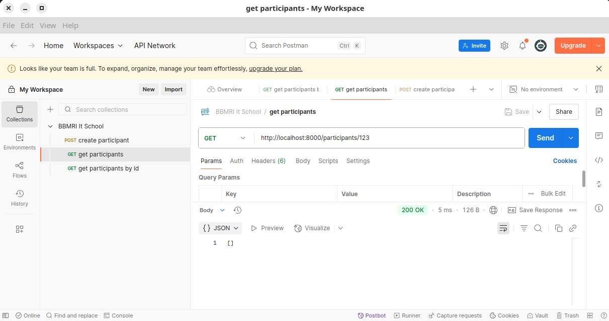

# REST API

In this tutorial you will practice how to implement a REST API with FastAPI

## Building a REST API with FastAPI

You will extend the `biobank_manager` project that we built in the [Data Management Tutorial](../02-tutorial-data-management/Data_Management_Tutorial.md) by adding a REST API layer.

> [!NOTE]
> Remember that there is also a base implementation for the data layer in the [solution directory](../02-tutorial-data-management/solutions/03-accessing-modelling-querying-prog/overall_solution/).
>

> [!NOTE]
> For the database you can use the same [compose](../02-tutorial-data-management/01-relational-databases/docker-compose.yml) file of the Data Management Tutorial. Since we don't need the omop schema for this tutorial, you can comment the line to deploy the omop schema
>
> `# - ./omop.sql:/docker-entrypoint-initdb.d/omop.sql`
>

We will create API endpoints for the entities Participants and Samples that we already developed (together with the related databaase) during the SQLAlchemy tutorial.

The REST API is composed of several levels of services: 
  - **Controllers**: they are the entrypoints of the API. They receive the requests from the client and call the services to perform the operations
  - **Services**: they contain the business logic of the application. They call the repositories to perform the operations on the database
  - **DTOs**: they are the Data Transfer Objects, the classes used to model the bodies of the requests and the responses of the API. 

### Steps 

1. First of all we must install FastAPI and Uvicorn in the virtualenv of the project
   
   **NB: remember to activate the virtualenv with `source venv/bin/activate`**

   ```bash
   pip install "fastapi[standard]"
   ```

1. The second step is to initialize our REST API. Edit the `biobank_manager/__init__.py` file with the following code

   ```python
   from fastapi import FastAPI

   app = FastAPI(
     title="Biobank Manager API",
     version="1.0.0",
     description="Biobank manager API for managing biobank data",
   )

   @app.get("/")
   def home():
     return {"message": f"Hello to {app.title}"}
   ```

   This code, simply creates the app and the first endpoint: the `home` function will respond to `GET /` requests by returning
   a JSON response with a welcome message

1. Ok now we need to serve the REST API so it can be exposed via network. To do that a common solution is [Uvicorn](https://www.uvicorn.org/) which a ASGI web server. Install it as usual with pip

   ```bash
   pip install uvicorn
   ```

1. Now we can add a `__main__.py` in the `biobank_manager` directory that simply run uvicorn which exposes the API

   ```python
   import uvicorn

   if __name__ == "__main__":
       uvicorn.run("biobank_manager:app", host="127.0.0.1", port=8000, reload=True)
   ```

   This command runs uvicorn and exposes a web server on the port 8000 of the local interface. Which application is handling the requests? Of course, the object `app` in the `biobank_manager` package, i.e., the FastAPI `app` instance that we created in the `__init__.py`.

   From the `main` directory, run the module 

   ```bash
   $ python -m biobank_manager
   INFO:     Will watch for changes in these directories: ['~/biobank_manager']
   INFO:     Uvicorn running on http://127.0.0.1:8000 (Press CTRL+C to quit)
   INFO:     Started reloader process [341658] using WatchFiles
   INFO:     Started server process [341678]
   INFO:     Waiting for application startup.
   INFO:     Application startup complete.
   ```
  
   Now navigate with a browser to `http://localhost:8000`, you should obtain as response the `json` 

   ```json
   { "message": "Hello to Biobank Manager API" }
   ```

1. We can start now to implement the endpoints for the Participants entities. We will need to create some objects:
   
   - the `controller`: the functions that handle the request for a specific endpoint
   - the `dtos`: the models of the request and response
   - the `service`: the business logic modules that create an interface between the controller and the database.
   
   Of course, we need also the `database` module, but we already created it in the prviouse tutorial.

   Let's create the directories for these objects with the module files

   ```
   biobank_manager/
     controllers/
       __init__.py
       participants.py
     dtos/
       __init__.py
       participants.py
     services/
       __init__.py
       participants.py
   ```

1. Let's implement the first endpoint. To get all the participants. Edit the file `controllers/participants.py` with the following code
   
   ```python
   from fastapi import APIRouter, status

   router = APIRouter(
     prefix="/participants",
     tags=["Participant"]
   )

   @router.get(
       "",
       description="Return a list of participants",
       status_code=status.HTTP_200_OK
   )
   def list_participants():
       return []

   @router.get(
       "/{pid}",
       description="Return the participant with the id specified in input",
       status_code=status.HTTP_200_OK
   )
   def retrieve_participant(pid: int):
       return { "id": pid }

   @router.post(
       "",
       description="Create a participant",
       status_code=status.HTTP_201_CREATED
   )
   def add_participant():
       pass
   ```

   This code defines a FastAPI router for the participants API. A router is used to handle a part of the API. It is usefult to split the API in small pieces so it's easier to maintain.
   
   The module creates three endpoints to handle:

   - `GET /participants`: return the list of participants
   - `GET /participants/{pid}`: return the specific participant with id `pid`
   - `POST /participants`: create a participant

   Notice the function `retrieve_participant`: the signature has a `pid` parameter with the same name of the parameter between brackets `{}` in the url of the endpoint `"{pid}"`. FastAPI will set the value of the parameter in the function, with the value sent by the client. For example the HTTP call
   
   ```http
   GET /participants/123
   ```

   Will pass `123` as the value of the pid argument of the `retrieve_participant` function.

   Two more things can be noted:
    - the `response_status_code` parameter of the `@router` decorator: it indicates the default status code returned if the operation is successfull (i.e., no exceptions are raised)
    - the `description` parameter of `@router` decorator: FastAPI use it for the swagger documentation of the API

   Before trying the endpoints, we need to tell the `app` objects that there is a router that handles the `/participants` sub-endpoints. To do that, edit the `biobank_manager/__init__.py` file to
   - add an import statement for the router 
   - call the `app.include_router` method of the FastAPI class to add the router

   ```python
   from biobank_manager.controllers.participants import router as participant_router
   ...
   app = FastAPI(
     title="Biobank Manager API",
     version="1.0.0",
     description="Biobank manager API for managing biobank data",
   )

   app.include_router(participant_router)
   ```

   To try the endpoints we can use the browser (only for GET endpoints), or we can use curl

   ```bash
   $ curl -X GET http://localhost:8000/participants -v 
   ...
   * Request completely sent off
   < HTTP/1.1 200 OK
   ...
   []

   $ curl -X GET http://localhost:8000/participants/123 -v
   ...
   * Request completely sent off
   < HTTP/1.1 200 OK
   ...
   {"id": 123}

   curl -X POST http://localhost:8000/participants -v
   ...
   * Request completely sent off
   < HTTP/1.1 201 Created
   ...
   null
   ```

   Or, even better, we can use Postman

   

1. Cool, but you probably noticed that our API is kind of useless until now. It returns an empty list, the id that we send, and an empty object.

   It's time for us to implement some logics to interact with the database. The `services` module will handle these logics.

   Let's edit the `services/participants.py` module to implement two functions to get the participants:

   - 'get_all_participants`: query the databse to get all participants
   - 'get_participant_by_id`: query the databse to get the participant with the specified id

   The functions simply call the repository functions that we already implemented to interact with the database

   ```python
   # services/participants.py
   from biobank_manager.database import repository

   def list_participants(session):
     return repository.get_all_participants(session)

   def retrieve_participant_by_id(session):
     return repository.get_participant_by_id(session)
   ```

   Now the two controllers must be changed to call the services

   ```python
   # controllers/participants.py
   from sqlalchemy.orm import Session
   from biobank_manager.database import get_db
   from biobank_manager.services import participants as part_services

   router = APIRouter(
     prefix="/participants",
     tags=["Participant"]
   )

   @router.get(
       "",
       description="Return a list of participants",
       status_code=status.HTTP_200_OK
   )
   def list_participants(session: Session = Depends(get_db)):
       return part_services.list_participants(session)

   @router.get(
       "/{pid}",
       description="Return the participant with the id specified in input",
       status_code=status.HTTP_200_OK
   )
   def retrieve_participant(pid: int, session: Session = Depends(get_db)):
       return part_services.retrieve_participant_by_id(session, pid)
   ```

   Nothing special to discuss. we're just calling the corresponing service function to retrieve the needed objects.
   Nothing special...but one thing. As you can see we need to pass to the service functions the db session. We already
   had a function in the `database` module that gets the session for us. But what's that second parameter in the controllers'
   functions? `session: Session = Depends(get_db)`. This is a [FastAPI Dependency](https://fastapi.tiangolo.com/tutorial/dependencies/). In simple words, FastAPI will inject the parameters defined using `Depends`. In this case it will
   inject the session object returned by get_db function.

   Let's try again the GET endpoints


   ```bash
   $ curl http://localhost:8000/participants

   * Request completely sent off
   < HTTP/1.1 200 OK
   < date: Tue, 15 Jul 2025 14:47:52 GMT
   < server: uvicorn
   < content-length: 18746
   < content-type: application/json
   < 
   [{
     "last_name":"Banzai",
     "place_of_birth":"Genova",
     "ssn":"BNZLTC34P51D969D",
     "id":2,
     "first_name":"Elastic",
     "date_of_birth":"1934-09-11",
     "gender":"F"
   },{
     "last_name":"Dhawan",
     "place_of_birth":"Bologna",
     "ssn":"DHWPCT15B66A944F",
     "id":3,
     "first_name":"Practical",
     "date_of_birth":"2015-02-26",
     "gender":"F"
   }
   ....
   ]
   
   $ curl http://localhost:8000/participants/2
   ...
   * Request completely sent off
   < HTTP/1.1 200 OK
   < date: Tue, 15 Jul 2025 14:50:35 GMT
   < server: uvicorn
   < content-length: 145
   < content-type: application/json
   < 
   * Connection #0 to host localhost left intact
   {
    "last_name":"Banzai",
    "place_of_birth": "Genova",
    "ssn":"BNZLTC34P51D969D",
    "id":2,
    "first_name":"Elastic",
    "date_of_birth":"1934-09-11",
    "gender":"F"
   }
   ```

1. As you may have noticed, FastAPI is able to automatically return a `JSON` serialization of the data retrieved from the database.
   Sometimes, we want to expose only a part of the data for a table, or we want to return the data formatted in a different way, or we want to change something in the data before returning it.
   Moreover, we didn't implement the POST controller yet. How can we define the body of the data that we expect from the client? How can we validate the data sent from the client or read from the database?
   Well, the answer is, as anticipated at the beginning is by using DTOs.

   With FastAPI the models are created using [Pydantic](https://docs.pydantic.dev/latest/).
   Let's define two models in the `dtos/participants.py`: one for the POST request body, one for the responses.

   ```python
   # dtos/participants.py
   from datetime import date
   from typing import Optional
   from pydantic import BaseModel, Field

   class ParticipantCreateDTO(BaseModel):
     prefix: Optional[str] = Field(title="An honorific prefix for the person (e.g., Dr.)")
     suffix: Optional[str] = Field(title="An honorific suffix for the person (e.g., MD.)")
     last_name: str = Field(title="Last name of the participant")
     first_name: str = Field(title="First name of the participant")
     date_of_birth: date = Field(title="Date of birth of the participant in ISO format (YYYY-MM-DD)")
     place_of_birth: str = Field(title="Place of birth of the participant")
     ssn: str = Field(title="Social Security Number of the participant")
     gender: str = Field("Gender of the participant")
 
   class ParticipantReadDTO(ParticipantCreateDTO):
     id: int = Field(title="Unique identifier for the participant")
  
     @computed_field
     @property
     def name(self) -> str:
       return f"{self.first_name} {self.last_name}"
   ```

   Before using the models let's point out something about the models:

   - The `ParticipantCreateDTO`, that we will use as body of the POST, defines a list of attributes. Most of them are required (i.e., not `Optional`). `prefix` and `suffix` are not optional. Pydantic is used to validate the response and the request. This means that if the client sends a body that misses one of the mandatory fields, a `ValidationError` will be raised.
   - All the fields are documented using the `title` attribute: it will be used to document the property in swagger
   - `ParticipantReadDTO` extends the `ParticipantCreateDTO` but adds the `id`. This is ok for the responses, since they return also the id of the read/created object. Moreover, it adds a computed field. This is to show how the DTOs are different than the DB row.

   Let's now change the controllers to use the models:

   ```python
   # controllers/participants.py
   from typing import List
   from biobank_manager.dtos.participants import ParticipantCreateDTO, ParticipantReadDTO
   from fastapi import APIRouter, Depends, status
   from sqlalchemy.orm import Session
   from biobank_manager.database import get_db
   from biobank_manager.services import participants as part_services

   router = APIRouter(
     prefix="/participants",
     tags=["Participant"]
   )

   @router.get(
       "",
       description="Return a list of participants",
       status_code=status.HTTP_200_OK,
       response_model=List[ParticipantReadDTO]
   )
   def list_participants(session: Session = Depends(get_db)):
       return part_services.get_all_participants(session)


   @router.get(
       "/{pid}",
       description="Return the participant with the id specified in input",
       status_code=status.HTTP_200_OK,
       response_model=ParticipantReadDTO
   )
   def retrieve_participant(pid: int, session: Session = Depends(get_db)):
       return part_services.get_participant_by_id(session, pid)

   @router.post(
       "",
       description="Create a participant",
       status_code=status.HTTP_201_CREATED,
       response_model=ParticipantReadDTO
   )
   def add_participant(data: ParticipantCreateDTO, session: Session = Depends(get_db)):
       return part_services.create_participant(session, data)
   ```

   We added the `response_model=ParticipantReadDTO` to tell FastAPI the model that the responses should return.
   Notice the in the `list_participants` it is a `List` of `ParticipantReadDTO`.
   In the POST controller we also added `data` parameter with `ParticipantCreatedDTO` as typehint. Now the controller expect the requeest body to be a valid json.

   Let's implement also the service `create_participant` function

   ```python
   # service/participants.py
   from biobank_manager.database import repository
   from biobank_manager.dtos.participants import ParticipantCreateDTO
  
   def create_participant(session, participant_data: ParticipantCreateDTO):
       db_data = participant_data.model_dump()
       del db_data["prefix"]
       del db_data["suffix"]
       return repository.create_participant(session, db_data)
   ```

   The service handles the business logic to manage the inpute and communicate with the database. 
   In this case creates a dictionary from the Pydantic model in input (`model_dump()`), removes the `prefix`, `suffix` that are not in the DB (yes, they were there just as example), and calls the repository function to store the new participant.

   Finally, let's edit also the repository to add the create_participant function

   ```python
   # database/repository.py
   def create_participant_data(session, data: dict):
       participant = Participant(**data)
       session.add(participant)
       session.commit()
       session.refresh(participant)
       return participant
   ```

   Test again the calls with curl
   
   ```bash
   $ curl http://localhost:8000/participants
   ...
   [{
      "prefix": null,
      "suffix":null,
      "last_name":"Banzai",
      "first_name":"Elastic",
      "date_of_birth":"1934-09-11",
      "place_of_birth":"Genova",
      "ssn":"BNZLTC34P51D969D",
      "gender":"F",
      "id":2,
      "name":"Elastic Banzai"
    },
    {
      "prefix":null,
      "suffix":null,
      "last_name":"Dhawan",
      "first_name":"Practical",
      "date_of_birth":"2015-02-26",
      "place_of_birth":"Bologna",
      "ssn":"DHWPCT15B66A944F",
      "gender":"F",
      "id":3,
      "name":"Practical Dhawan"
   }
   ```
   
   This time we have `prefix`, `suffix` and the computed `name`. Notice that FastAPI is able to convert the data from SQLAlchemy to Pydantic.

   Now let's create a participant using the `POST /participants` endpoint

   
   ```bash
   $ curl -H "Content-Type: application/json" \
          -d '{"prefix": "Dr.", "last_name": "Doe", "first_name": "John", "date_of_birth": "1990-01-01", "place_of_birth": "New York","ssn": "DOEJHN90A01Z404E", "gender": "M"}' \
          -X POST http://localhost:8000/participants
          
   {
    "prefix": null,
    "suffix": null,
    "last_name": "Doe",
    "first_name": "John",
    "date_of_birth": "1990-01-01",
    "place_of_birth": "New York",
    "ssn": "DOEJHN90A01Z404E",
    "gender": "M",
    "id": 129,
    "name": "John Doe"
   }
   ```

   As expected, the server returned the created object but it added the `id` of the created object.
   Notice, though, that the returned `prefix` returned null but we should expect the value we sent in the request (`"Dr"`).
   Why do you think it happened?

1. Try to make the POST above twice, then check the database. What happens? Try to change the code 
    in a way to avoid this issue. 

1. Now that you've learned how to implement the endpoints with FastAPI continue the implementation to:
   
   - Add a DELETE endpoint for participants `DELETE /participants/{pid}`
   - Add components to manage samples and diagnosis for participants. For example for the samples it may be:
     - `POST /participants/{pid}/samples`
     - `GET /participants/{pid}/samples` 
     - `GET /participants/{pid}/samples/{sid}`
   
1. As an extra assigment, try to add some query parameters to the GET endpoints to query the entities

   For example you can add search by `last_name`, `family_name` and `ssn` for participants and query by `type` for samples. 

   As a reference che the FastAPI [documentation](https://fastapi.tiangolo.com/tutorial/query-params/)

## Interacting with a REST API

1. Create a script that uses [requests]`https://pypi.org/project/requests/` to perform some actions on the REST API you have just implemented. 
   
   For example the script can:
    
   - create a participant
   - add some samples and diagnosis for the participant
   - perform some GET requests

1. Create a Postman collection that performs the same operations