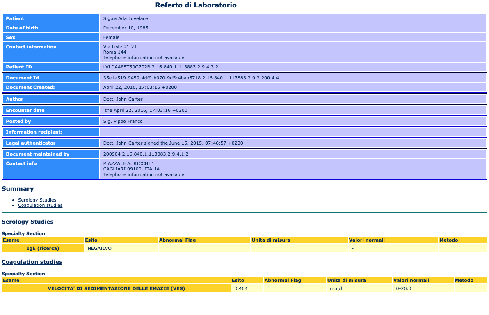
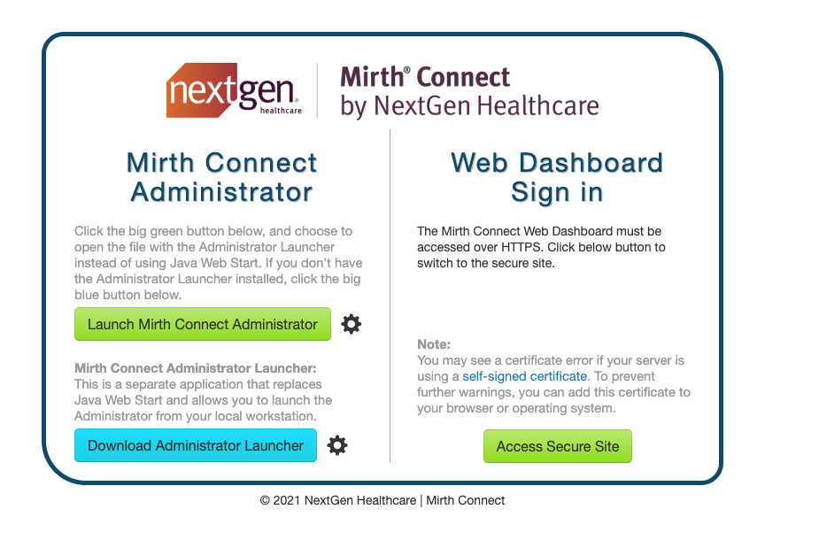
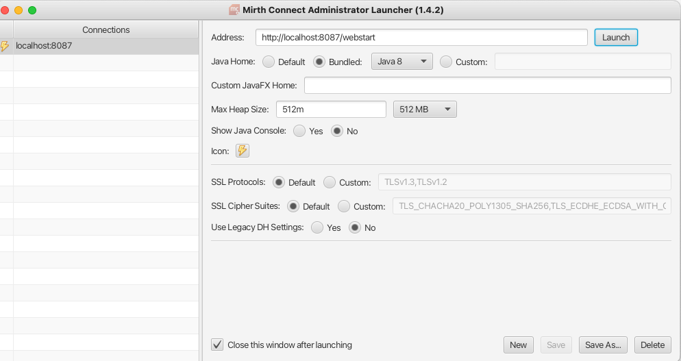
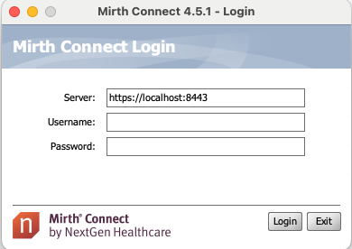
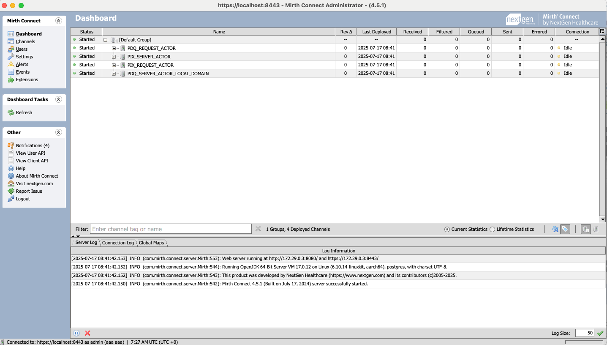
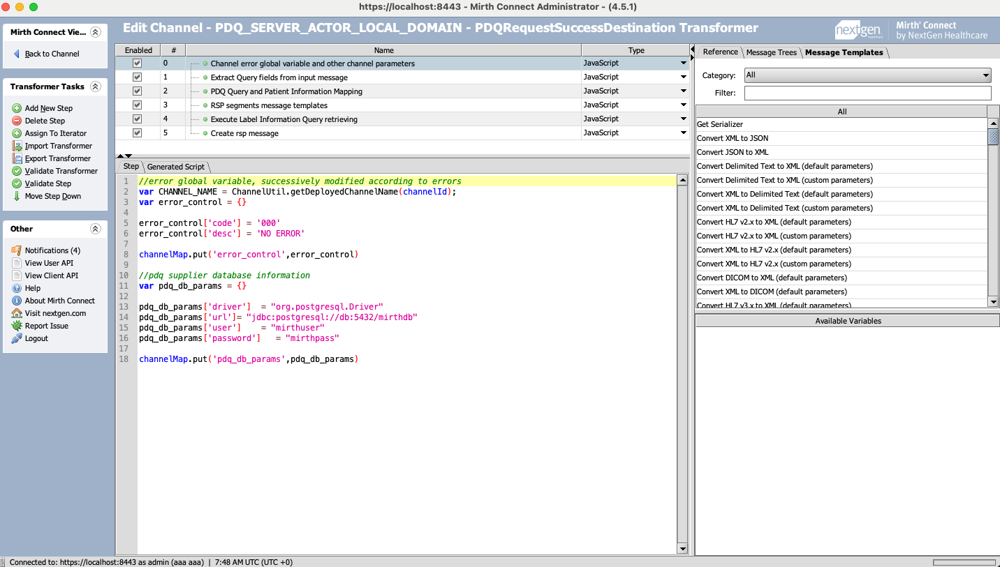

# Hl7v2, CDA, IHE Tutorial

In this tutorial, we will acquire familiarity with HL7v2 and CDA standards, with some examples and 
exercises with the aim to understand how to use them in practice. 
We will then learn how to use HL7v2 in the context of an IHE profile by implementing a Patient Demographics Query (PDQ)
Consumer actors in Python, using the HL7 v2 library [hl7apy](https://github.com/crs4/hl7apy). We will perform the query against a 
PDQ Supplier, developed using Mirth Connect, that we will run in a Docker container.

## HL7 v2: "Reading a message structure".

Given this HL7v2 message:

```
MSH|^~\&|ARS_APP|ARS_PDQ_SUPPL|PDQ_Consumer|Consumer_Facility|20250707112234||RSP^K22^RSP_K21|7b1bf755-99d2-4929-9904-08fade31cf52|D|2.5|||||IT||EN
MSA|AA|123456|
QAK|QRY12345|OK||1
QPD|Q22^Find Candidates^HL7|QRY12345|@PID.5.1.1^Smith~@PID.5.2^Amy
PID|||IHERED-1005^^^IHERED&1.3.6.1.4.1.21367.13.20.1000&ISO||Smith^Amy^^^^^L||19610228|F|||5660 S Palo Verde^^Tucson^USA^85706^^H
```

1. What is the message type? In which context has this message been used?
1. How many segments are there in the message?
1. Is it a request message or a response message?
1. How many components does the QPD.1.1 field have? What is the value of QPD.1.1?
1. Which is the unique identifier of the message?

## CDA: Inspecting the document and its structure
Given the CDA document under /CDA named sample:CDA.xml, inspect the raw XML document 
structure and answer the following questions: 

1. Who is the related patient?
1. Who is the author and the custodian of the document?
1. Which is the unique identifier of the document?
1. Does the component have a structured body? Identify it 
1. How many sections are there in the document?
1. How many observations are there in the document?

Then, render the CDA document in a browser. 

> [!NOTE]
> The `sample_cda.xml` document contains a reference to a stylesheet XLS document.
> To be able to render the document, you need to run the browser without the security restrictions, so that it can access the stylesheet.

You should see a result like this




## IHE: Implementing a PDQ Consumer

In this section, we will implement a PDQ Consumer using the HL7v2 library `hl7apy`. As a PDQ supplier,
we'll use a Mirth Connect implementation that we will run in a Docker container. This implementation has
a simple demographics table; the "PDQ_SERVER_ACTOR_LOCAL_DOMAIN" channel receives as input
the request message from the consumer, extracts the query parameters from it, and 
creates the DB query to search for results. Then, according to the results, it builds the response 
message and sends it back to the consumer.

> [!TIP]
> Keep in mind that for every doubt about the transaction, you can look at the IHE specifications as a reference.
> The PDQ transaction is available [here](https://profiles.ihe.net/ITI/TF/Volume2/ITI-21.html)
> In particular, have a look at the  [Message semantics](https://profiles.ihe.net/ITI/TF/Volume2/ITI-21.html#3.21.4.1.2) and [Query Parameters](https://profiles.ihe.net/ITI/TF/Volume2/ITI-21.html#3.21.4.1.2.3) sections. 
> .

1. First, let's run the docker container. From ./mirth-connect, run:

   ```bash
   docker compose up -d 
   ```

   You should see a message like this:
   ```
   ✔ Network mirth-connect_default  Created    0.0s
   ✔ Container postgres             Started      0.1s
   ✔ Container mirth                Started      0.0s                                                                                                                                                 ```
   
3. This step is not mandatory, but it may be useful for you to see a Mirth Connect channel in action.
   After having run the container, let's start the Mirth Connect administrator app to check 
   the Mirth Channels and also to inspect the code of the PDQ Server channel.
   
   Using a browser, access [http://localhost:8087](http://localhost:8087) and download the administrator launcher.
   
   The page will look like this:
   
   

   Click on `Download Administrator Launcher`, which will download the installer for the Mirth Connect
   application. Install and run the application. At startup, you should see this page:

   

   Click on `Launch` to open the Mirth Connect Administrator application:
    
   

   Type admin/admin as username and password. The application will open. The first time, you
   shall see a form that allows you to change the username and password and fill in some mandatory
   information. Complete the form and confirm the operation.
   
   The Mirth Connect Dashboard will then open:

   

   Here you can see the active channels. As soon as the channels receive messages, the counters 
   in the dashboard will increase, and you can also check message logs by double-clicking on the channel. 
   Now let's focus on the `PDQ_SERVER_ACTOR_LOCAL_DOMAIN` channel. In the left panel, click on `Channels`, 
   then search for the channel named `PDQ_SERVER_ACTOR_LOCAL_DOMAIN`. Double-click on it to open the channel 
   in editing mode and see how it is implemented; click on the `Destinations` tab and then `Edit transformers`
   Click on some of the JavaScript steps to see the code that parses the HL7 v2 input message, extracts the
   query parameters from it, creates the output message, and sends it back to the consumer:
               
   

   
5. Now, let's implement the PDQ Consumer in Python to send some HL7 queries to the Supplier.
   First, install the `hl7apy` library:

   ```bash
   pip install hl7apy
   ```
   
   Then, we will proceed to write the code. Refer to this example of PDQ Consumer [here](https://github.com/crs4/hl7apy/blob/develop/examples/iti_21/client.py)
   Copy it into a local Python file, named `pdq_consumer.py`.
   We will make several changes to this code. We have to modify the msg `template message` to set up
   the values according to our use case. To do that, it is better to parse the message first. 
   At line 32, let's parse the message:

   ```python
   parsed_msg = parse_message(msg)
   ```

   In this way, we can assign the fields' value to the message directly with the dot notation. Remember
   that HL7apy either supports the notation by field name or by index. For example, to set the value
   of the sending application `MSH.3`, you can do:

   ```python
   parsed_message.msh.sending_application = 'BBMRI-IT-SCHOOL-APP'
   ```

   Or, alternatively
   
   ```python
   parsed_messagem.msh.msh_3 = 'BBMRI-IT-SCHOOL-APP'
   ```
   
   Proceed in the same way and add the code to set the value of the following fields:
   - Sending Application (MSH.3): Choose a code for your custom application
   - Sending Facility (MSH.4): Choose a code for your custom facility
   - Receiving Application (MSH.5): Set it to the code of the receiving application (Mirth Connect PDQ Supplier): 'ARS_APP'
   - Receiving Facility (MSH.6): Set it to the code of the receiving facility (Mirth Connect PDQ Supplier): 'ARS_PDQ_SUPPL'
   - MSH.7: Set it to the current date and time in the format YYYYMMDDHHMMSS
   - MSH.10: Assign to it a unique identifier for the message; use the [uuid](https://docs.python.org/3/library/uuid.html) package for that
   - QPD.1: Set it to "IHE PDQ Query"
   - QPD.2: It must be a unique query identifier; use the [uuid](https://docs.python.org/3/library/uuid.html) library for that
   
   It's time to add the query parameters. They are repetitions of the QPD.3 field, as per specification. 
   Try to execute the Python module several times, trying some queries. Under the `./mirth-connect` directory, there is 
   the `demographics.csv` file that contains a dump of all demographics that are queried by the PDQ consumer. 
   Try different kinds of queries, involving the following fields:

   - Query with last name = "Smith". We expect 4 responses: Smith Albert, Smith CHarles, Smith Amy, Smith Carrie.
   - Query with last name = Smith and gender = "F". We expect 2 responses: Smith Amy, Smith Carrie.
   - Query with date of birth = "19610131"- We expect 2 responses: Smirth Charles, Hon Charles.
   - Query with address city = "Tucson". We expect 8 responses in total.
   
   Now, perform a query with an unknown parameter code, (e.g., `"PID.x.x"`) so you can force an AR (Application Reject) ack from the PDQ Supplier. 
   Check the response message error sent by the PDQ supplier.
   
   For each query, write a simple piece of code that parses the received message, scans the results, and
   writes a simple JSON with all the main attributes for each result: id, last name, first name, date of birth.
