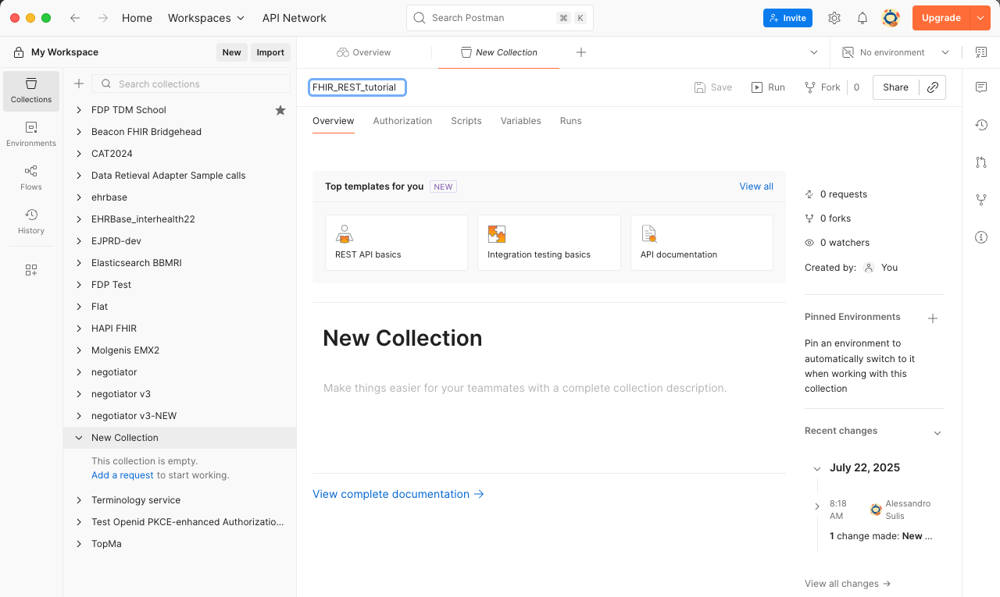
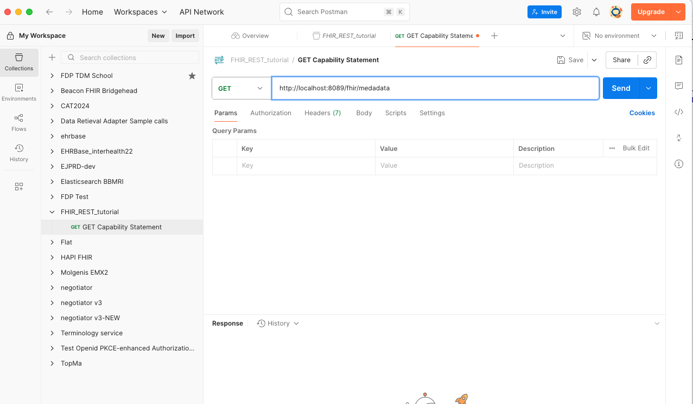
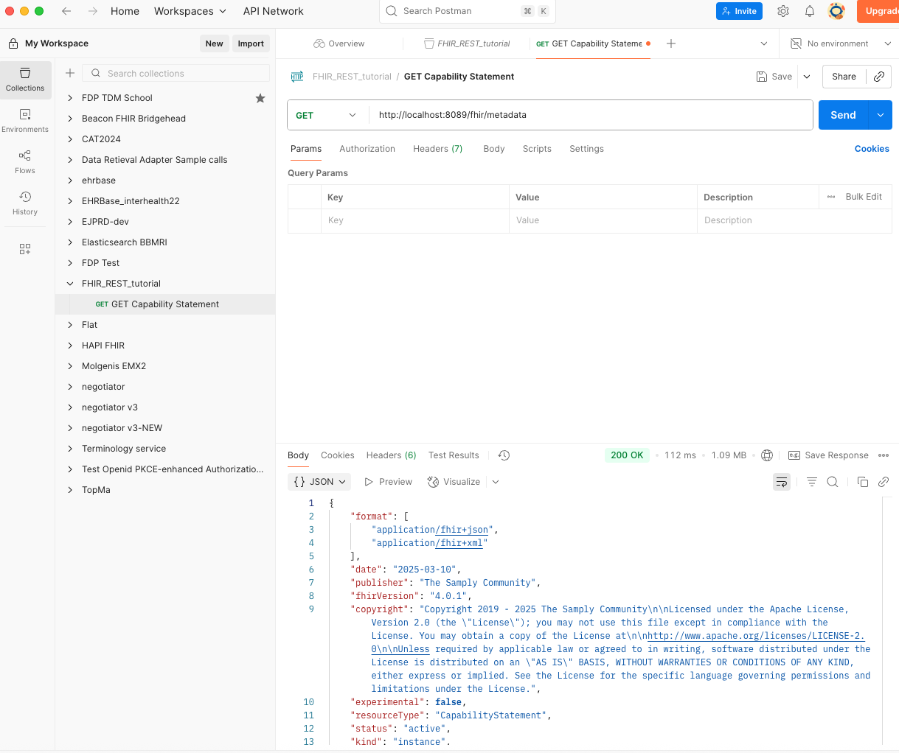
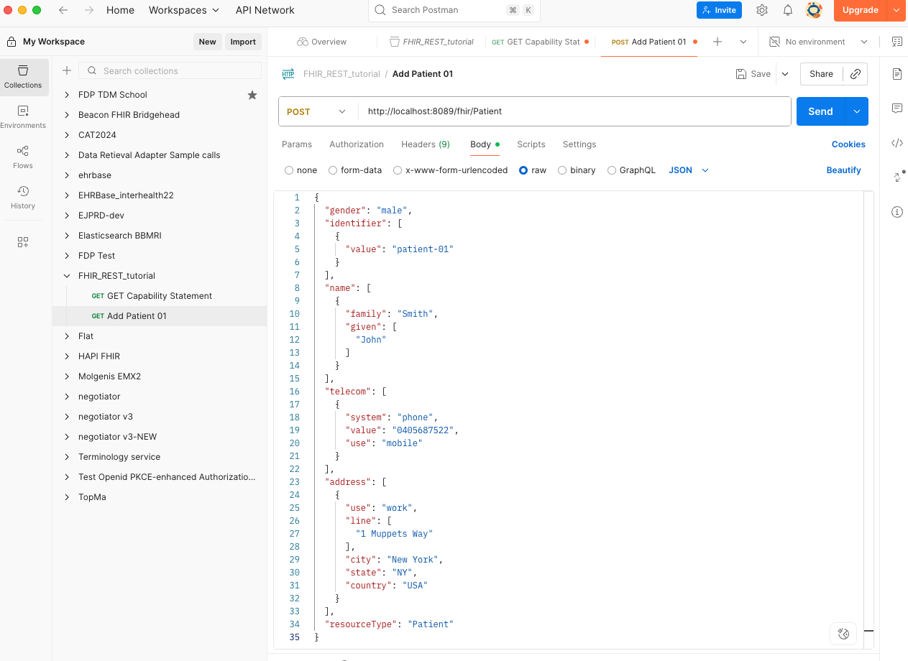
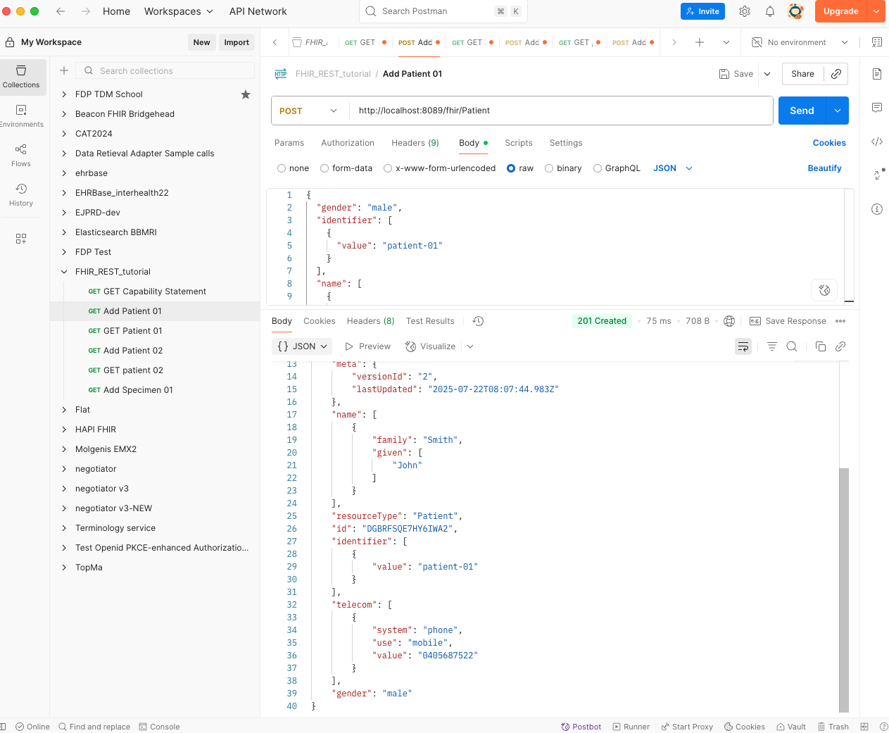
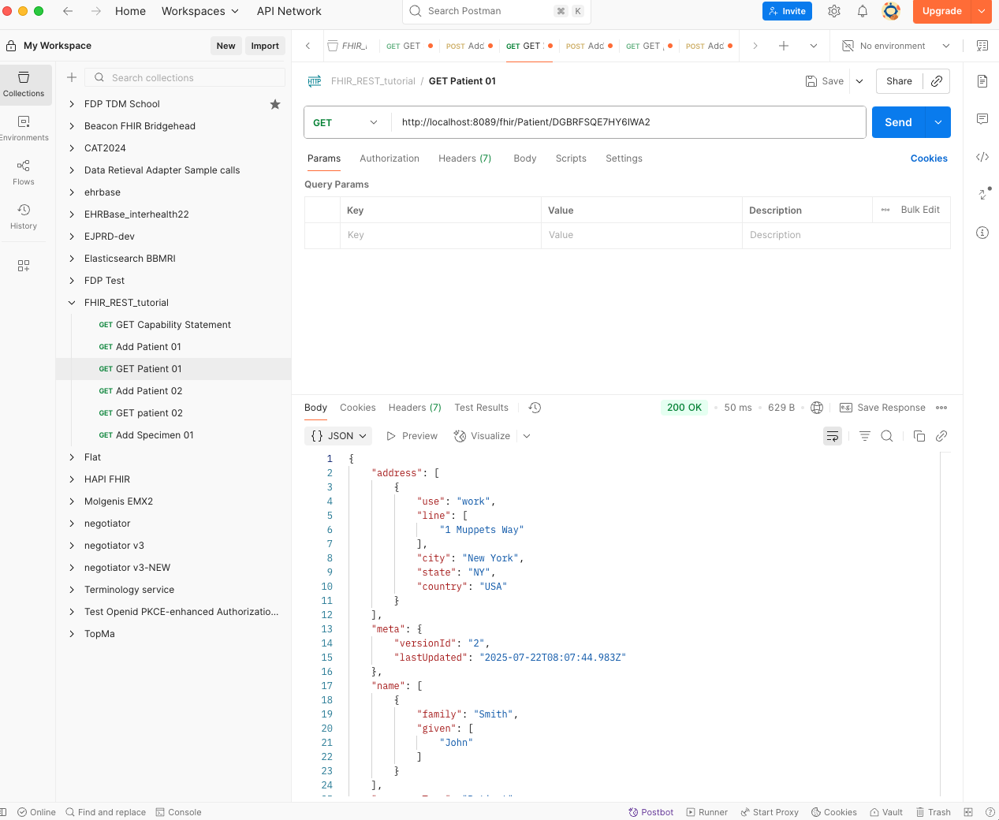
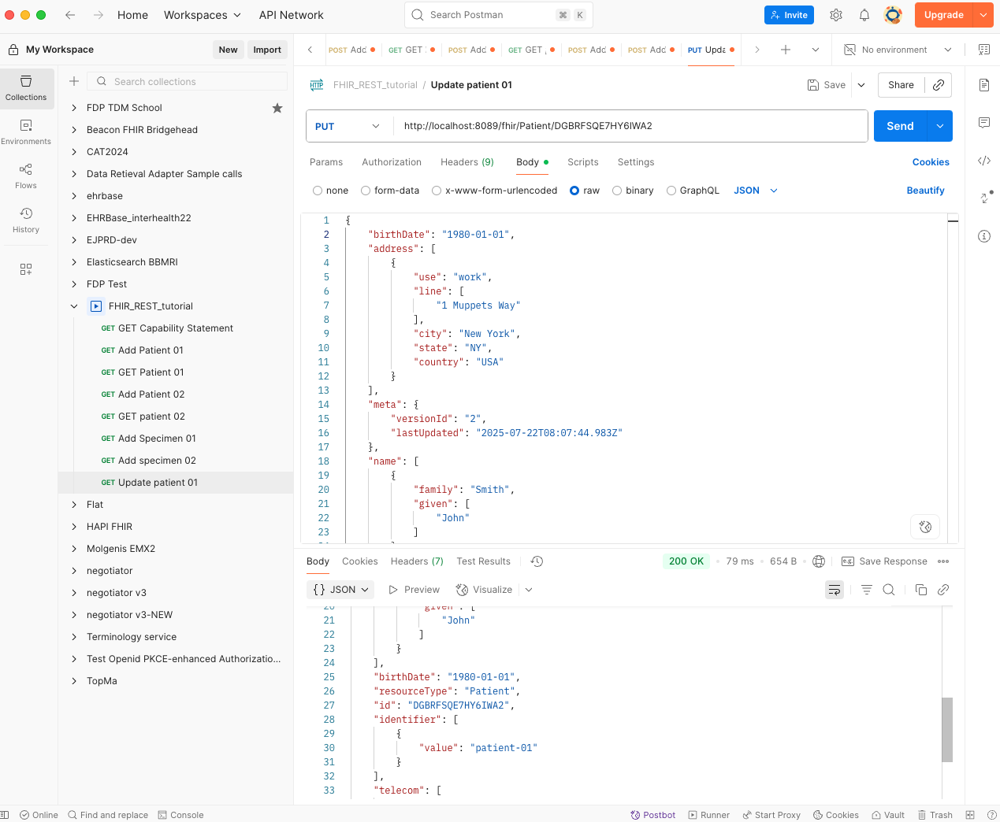

# FHIR: understanding FHIR and Resources structure 
In this first section we will practice with the structure of a resource, analysing and identifying the 
components and elements.
We will take the Specimen resource as an example. Let's identify the stucture of the Specimen resource in 
version 4.0.1 of FHIR, by looking at the official FHIR specification:
https://www.hl7.org/fhir/Specimen.html

Look at the specifications and try to identify: 
1. The scope and usage
2. The mandatory elements 
3. The elements that must have a value taken from a code system
4. The elements that are references to other resources. Which are the resources they reference?

# Managing APIs in FHIR
As we have seen in the lectures, FHIR defines a RESTful API to interact with the resources. We will now 
learn how to interact with the FHIR API, with the various operations. To do that, we wull use as FHIR server
the one provided by BBMRI.de, that is the same used by the Sample Locator (we will talk a lot about it in 
future lessons).

First, we will run the docker compose to start the fhir server. From ./blaze, run:
```bash
docker compose up -d
```
This will start the FHIR server. We will use Postman, that we also used in the previous tutorial, to interact with it.
Open Postman and on the left side, near the "Colections" tab, click on the "+" button to create a new collection. 
Name the collection "FHIR_REST_tutorial" and click on "Create":



Now you should see the new collection in the left side panel. Click on the three tabs on the right and
create the first GET request, by selecting "Sdd request" in the appearing panel. Name it 
"GET Capability Statement". It is a request of type GET, whose url is the base url of the FHIR server, that 
is running on the port 8889, followed by "/metadata". So the full url is:
```
http://localhost:8889/fhir/metadata
```
Put it in the postman request url field: 



Now_click on the "Send" button to send the request. You should see a response like this

This is just a get to check that the FHIR server is running and able to provide the capability statement.
Notice that the JSON response is very big, because it contains all the operations for all the resources that 
the server is able to manage.
The server is empty, it means that it does not contain any resource yet. We'll now add some resources, through 
some POST requests. The ./resources folder contains the resources to add. We will add some patients and some 
related specimens. 
Now, in the same way we did for the capability statement, let's create a new request in the collection, named
"Add Patient 01". In this case we have a POST request on the Patient resource. We'll set it this way: 
1. Set the request type to POST and enter the url: ```
        http://localhost:8089/fhir/Patient 
        ```
2. In the radio buttons below the url, select "Body" and then "raw".
3. In the dropdown on the right, select "JSON" and paste the content of the file 
   `./resources/patient01.json` in the body field.
The setup of the POST request shouls appear like this:



Now, click on the "Send" button to send the request. You should see a response like this:


There are some important remarks to do about the response:
- The status 201 created means that the resource has been created successfully.
- As explained on the slide 13 of the lessons, pay attention to the idetifiers in the response:
    - a) id "DGBRFSQE7HY6IWA2" is the unique identifier assigned by the server to the resource. You'll
               noice that yours in your own response is different from this one. This id is the one that must
               be used to refer to reference the resource in other resources. It is also the identifier to 
               directly access the resource, by using the url:
               ```
                 http://localhost:8089/fhir/Patient/DGBRFSQE7HY6IWA2
               ```
    - b) identifier "patient-01" is instead the value of the identifier attribute that is part of the 
               patient resource, that has been assigned by us.

We can now create a new GET request im postman, named "Get Patient 01", to retrieve the patient we just created:



In the same way that we did for patient 01, set up all the postman request to add and get patient 02.
Now, let's add two specimens, each one related to one of the two patients we just created. The reference must 
be set in the "subject" attribute of the specimen resource (we are referring to FHIR version 4.0.1). 
Create a new POST request in postman, named "Add Specimen 01". The url must be: 
```
http://localhost:8889/fhir/Specimen
```
Before copying the body from ./Specimens/specimen01.json, be careful to set up the proper reference to the 
patient01 in the "subject" attribute, that for this exemple is:
```json
{
  "reference": "Patient/DGBRFSQE7HY6IWA2"
}
```
If all went fine, you should see a response like this:


Now, make the same for the second specimen, relating it to the second patient.

The PUT operation is used to update a resource. Notice that the added patients miss the 
date of birth. Let's create a new Postman request named "Update Patient 01" to add it. 
In the url we have to refer to the patient we want to update, so it will be:
```http://localhost:8889/fhir/Patient/DGBRFSQE7HY6IWA2
```
In the body, instead, we will have the same body used to create the patient, but with the
date of birth added. We will add this attribute: 
```json
"birthDate": "1980-01-01"
```
Now, click on the "Send" button to send the request. You should see a response like this:


Notice that now the birthDate attribute is part of the response, meaning that the 
patient has been updated successfully.

# Implementing a IHE PDQ Consumer in FHIR
This section has the purpose to implement a PDQ Consumer in FHIR, compliant with the IHE PDQm 
profile. This is the same as we did in the previous tutorial, where we implemented a PDQ Consumer
in HL7 v2. The two actors involved in the transaction are the same, and also their behaviour and 
the query parameters are the same. What changes is the adopted standard, that in this case is FHIR. 
As PDQ supplier, we will use the one provided by the Gazelle's Patient Manager application. Gazelle 
is the reference platforms used for testing, where Vendors can find simulators and validators to 
prepare themselves for the IHE Connectathon. 
The endpoint to the PDQ Supplier provided by Gazelle is this one: 
https://gazelle.ihe.net/PatientManager/fhir/ (1)
You can also check the capability statement at: 
https://gazelle.ihe.net/PatientManager/fhir/metadata
According to the specification, (1) is the base endpoint of the PDQ Supplier, and we can query 
it to get demographics that match the query parameters. Refer to the 
lesson slides or to the profile documentation for the details of the query parameters: 
https://profiles.ihe.net/ITI/PDQm/ITI-78.html (Section 2:3.78.4.1.2.1 Search Parameters)
For example, we can query the PDQ Supplier for a patient with a specific family name, directly from shell, in this way; 
```bash
curl -X GET "https://gazelle.ihe.net/PatientManager/fhir/Patient?family=Smith" \
     -H "Accept: application/fhir+json"
```
Anyway, our purpose is to implement a PDQ consumer client in Python, able to query the Supplier and parse 
its response and results. To do so, we will use the FHIR client library for Python. First, we need to install the library:
```bash
pip install fhirclient
```
Then, refer to the slide #35 "Programmatic Interactions" for an example of how to use the library to 
implement the PDQ Consumer with FHIR client. 
To do so, let's create a python module, named `pdqm_consumer_fhir.py`, that will implement the PDQ Consumer.
First, let's import the fhirclient library and define a dictionary with the proper settings to instantiate the client:
```python
from fhirclient import client
from fhirclient.models.patient import Patient
    
PDQ_SUPPLIER_BASE_URL = "https://gazelle.ihe.net/PatientManager/fhir"
    
settings = {
    'app_id': 'tet_pdqm_consumer',
    'api_base': PDQ_SUPPLIER_BASE_URL
 }
```
Then, we can instantiate the client:
```python
pdqm_consumer_client = client.FHIRClient(settings=settings)
```


Now we are ready to define the query parameters, by defining a dictionary containing them: 
```python
query_params = {
    'family': 'Smith',
    'given': 'John'
}
```
Remember that each key name in the dictionary must march the name of the search parameter defined in the
PDQm profile. You can add or remove parameter by adding or removing keys in the dictionary.

We can now perform the query, in order to search for Patient resources that match the query parameters: 
```python
patients = query.perform_resources(pdqm_consumer_client.server)
print (f'Found {len(patients)} results')
```
The patients variable will contain a list of Patient resources that match the query parameters. We can iterate on 
them to get the details of each patient:
```python
for patient in patients:
    name = patient.name[0]
    given = name.given
    family = name.family 
    [....]
```

In the same way as we did for the PGQ Consumer in HL7 v2, make several queries with some parameters: 
      - Query with last name = "Smith". We expect 4 responses: Smith Albert, Smith CHarles, Smith Amy, Smith Carrie.
      - Query with last name = Smith and gender = "F". We expect 2 responses: Smith Amy, Smith Carrie.
      - Query with date of birth = "19610131"- We expect 1 response: Smith Charles
      - Query with address city = "Tucson". We expect 4 responses in total.

Now, for the query with last name = Smith, limit the query to only 1 result, by adding the _count 
parameter and setting it to 1. When parsing the response, refer to the "next" link in the result, 
provided by the client, ans make a new query with this ling to get the result (you can use request library
and make a simple GET for that). For example:
```python
import requests
import pprint
PDQ_SUPPLIER_BASE_URL = "https://gazelle.ihe.net/PatientManager/fhir"

response = requests.get(f"{PDQ_SUPPLIER_BASE_URL}/Patient?family=Smith&_count=1",
          headers={"Accept": "application/fhir+json"})

if response.status_code == 200:
  bundle_json = response.json()
  pprint.pprint(f'Found {bundle_json}' )
```
In the printed output, identify the current result, that is limited to 1, and the "next" link, that allows to get 
the next result. 
Exercise: improve the previous code to parse the output, get the next link and use it to perform a new
get request to obtain the next result. Iterate this until there are no more results (you will not find a "next" link in the output anymore).


# Creating a FHIR IG with FHIR Shorthand and Sushi 
In this part of the tutorial, we will learn how to create a FHIR Implementation Guide (IG) using 
FHIR Shorthand (FSH) and the SUSHI tool, starting from a pre-built and configured docker 
image.

## 1. Check the project and run the container for the first time
The project is under ./fhir-fsh-sushi-ig that is a project respecting the structure required 
by fhir shorthand and sushi for creating a FHIR IG. This includes: 
    - a input/fsh folder with the FSH files: here we will put the .fsh files that define the 
      resources, profiles, value sets, etc. of our IG. All the objects that we are going to 
      profile in the IG will be defined in this folder. Notice that there is only a simple 
      "SpecimenProfile.fsh" file in this folder, that simply defines a profile from the 
      4.0.1 FHIR Specimen resource, but without profiling anything (we will add some rules later).
    - a sushi-config.yaml file that defines some metadata of the generated IG, such as the 
      name, title, description, etc. of the IG. This file is used by SUSHI to generate the IG and we 
      do not have the need to change it for the moment.
    - a ig.ini file, defining some configuration, in particular where the publisher should take the 
      output files generated by SUSHI. This file is used by the publisher to generate the IG and we
      do not have the need to change it for the moment.

Now, check the docker compose: it runs a container with the SUSHI tool and the publisher script, and 
has all the directories mounted in the container. The container is configured to run the SUSHI tool
and the publisher script when it starts, so we can run the container and generate the IG by running:
```bash
    docker compose up
```
If all went fine, you should see a long output in the terminal, that ends with this sentence: 
```
    fhir-fsh-sushi-ig-fhir-ig-1 exited with code 0
```
This means that the SUSHI tool has generated the IG and the publisher script run successfully.
All the output files are in your local folder, thanks to the docker volume, and we can load 
the home page of the IG in a browser by opening the file:
```
    ./fhir-fsh-sushi-ig/input/fsh/output/toc.html
```
Notice that if from here you click on "My custom specimen profile" link, you will se a page where 
the profiled Specimen Resource has not differentials (the differentials tab is empty) because we have not 
defined any specific profile rule yet. 

## 2. Add a profile rule to the Specimen profile
Now we can add a rule to the Specimen profile. Open the file:
```
    ./fhir-fsh-sushi-ig/input/fsh/SpecimenProfile.fsh
```
And add the code to create an extension to the specimen profile, for example:
```fsh
Extension: SpecimenCustodian
Id: specimen-custodian
Title: "Specimen Custodian"
Description: "An extension to indicate the custodian responsible for the specimen."
* value[x] only Reference(Practitioner or Organization)
* ^context.type = #element
* ^context.expression = "Specimen"

Profile: MySpecimenProfile
Parent: Specimen
Id: my-specimen-profile
Title: "My Custom Specimen Profile"
Description: "A specimen profile extending the base Specimen resource"

* extension contains SpecimenCustodian named custodian 1..1
```
Notice that, if the extension is in the same .fsh file of the profile, it must be put on the top (before
the profile definition, that is referencing it).
The last line of the profile definition adds the extension to the profile, with a cardinality of 1..1, meaning that the extension is mandatory.
Now, we can run the SUSHI tool again to generate the IG with the new profile rule. Run again:
```bash
    docker compose up
```
Check now the diff tab in the profile page of the IG, you should see the new extension added to the profile.

Exercise: now, try to add a new extension to the profile, for example an extension to indicate the 
disease that the specimen is related to, and run again the SUSHI tool to generate the IG with the new profile rule


