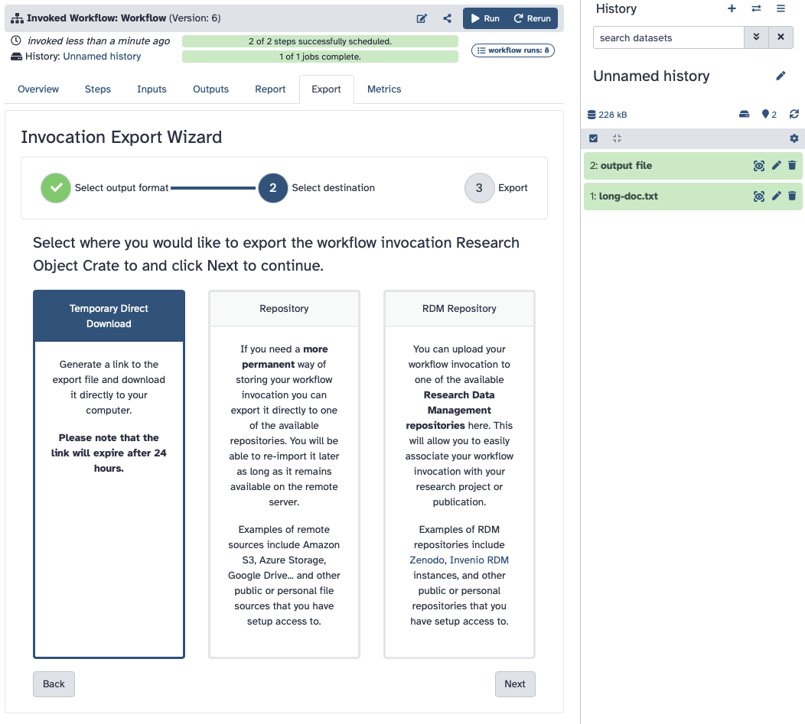

# Introduction to the Galaxy workflow manager

Galaxy is a web-based platform that enables accessible, reproducible, and collaborative biomedical data analyses through workflows.  In this section, you'll get to familiarize yourself with the usage of Galaxy and how to extract provenance data from the analyses executed on the platform.

## A short introduction to Galaxy

Complete this tutorial from the Galaxy Training Network (GTN): [A short introduction to Galaxy](https://training.galaxyproject.org/training-material/topics/introduction/tutorials/galaxy-intro-short/tutorial.html).
* Keep your work environment on the Galaxy server open as we'll keep using it in later steps of this tutorial.

## Galaxy and FAIR Workflows

Galaxy embraces the FAIR (Findable, Accessible, Interoperable, Reusable) principles, providing robust support for creating and sharing reproducible workflows.  Also, the Galaxy community has created a very extensive body of training material.

If you're interested in studying this topic further, feel free to explore the Galaxy Training Network's section on [FAIR Data, Workflows, and Research](https://training.galaxyproject.org/training-material/topics/fair/).

### Workflow Run RO-Crates in Galaxy

Since version 23.00, Galaxy has introduced the ability to export workflows as **Workflow Run RO-Crates** (WRROC). As we saw during the lecture, WRROC packages can capture workflow execution details, including inputs, outputs, parameters, etc. in a structured, machine-readable format, while also maintaining some degree of human readability.

### Export a Workflow Run RO-Crate from Galaxy

#### 1. Select the workflow invecation in Galaxy

In the first step on this page -- the Short Introduction to Galaxy -- you executed a workflow on the Galaxy instance.

If you need to do so (e.g., if you changed the Galaxy view since you finished executing the workflow), select the workflow invocation from the workflow invocation list (you can find it by clicking on the *Workflow Invocations* on left menu).

*Figure: Selecting a workflow invocation from the list of executed workflows in Galaxy*

---

#### 2. Go to the **Export** tab

Select the **Export** tab.  Here you'll see several export possibilities.

    

<em>Figure: Selecting the Export tab in the workflow export wizard</em>

---

#### 3. Export an RO-Crate

Select **Research Object Crate** / **Workflow Run RO-Crate** as output format, and then click **next** to continue.

    

<em>Figure: Selecting Research Object Crate as the output format in the workflow export wizard</em>

---

#### 4. Select **Temporary Direct Download**

Select **Temporary Direct Download** as destination and then click **next** to continue.

    

<em>Figure: Selecting Temporary Direct Download as the destination in the workflow export wizard</em>

---

#### 5. Click on **Generate Download Link**

Click on **Generate Download Link**.  This action will trigger a Galaxy job to produce the crate archive and automatically start the download as soon as it's ready.

---

#### 6. Examine the contents of the downloaded .crate.zip file

Now, on your system, you should have a [Workflow Run RO-Crate](https://www.researchobject.org/workflow-run-crate/) archive (which is a type of RO-Crate, and is a zip file). The generated RO-Crate conforms to the [Workflow Run Crate profile](https://www.researchobject.org/workflow-run-crate/profiles/workflow_run_crate/).

The exported RO-Crate package contains metadata describing the workflow execution, including the workflow definition (as it extends the [Workflow RO-Crate profile](https://w3id.org/workflowhub/workflow-ro-crate/)). It is as a FAIR digital object that can be shared, cited, and reused across different platforms.

You'll get to experiment with this and other RO-Crates in the [RO-Crate section](./RO_crate.md) of the tutorial.
