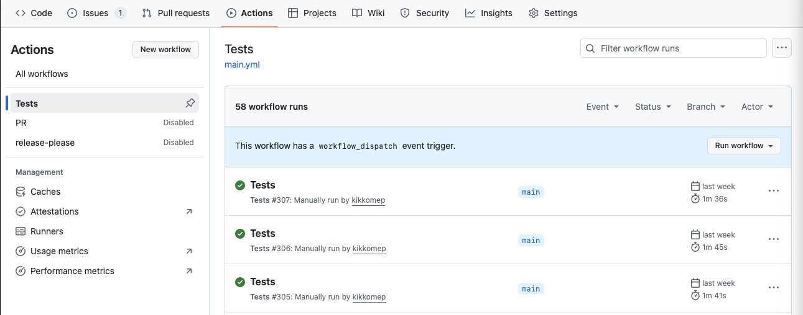

# Workflow Best Practices

## Introduction

Workflows are a powerful way to encapsulate complex data analyses in a reproducible manner. However, to ensure workflows remain usable over time, it's essential to follow best practices for testing, continuous integration, and maintenance. This tutorial will guide you through setting up tests for Galaxy workflows, automating these tests with GitHub Actions, and implementing maintenance automation using LifeMonitor.

> 💡 **Applicability to other workflow systems**
>
> While this tutorial primarily focuses on Galaxy workflows, it's important to note that the best practices discussed here—testing, continuous integration, and maintenance automation—apply to workflows developed with any workflow management system. The specific tools and commands may differ (e.g., replacing `Planemo` with the appropriate testing framework for your workflow manager), but the core principles remain the same. You can adapt these practices to `NextFlow`, `Snakemake`, `CWL`, or any other workflow system by substituting the appropriate tools and commands for your platform.

> 📚 **Galaxy Workflow Best Practices**
>
> For more information about best practices for Galaxy workflows, you can follow this link: [Best Practices for Maintaining Galaxy Workflows](https://planemo.readthedocs.io/en/latest/best_practices_workflows.html)

---

## 1. Keep workflows versioned

Version control is crucial for maintaining reproducibility and tracking changes in your workflows over time. Let's set up a GitHub repository to properly version your Galaxy workflows.

### Create a repository for your workflow

1. Go to [GitHub](https://github.com) and sign in to your account
2. Click on the "+" icon in the upper right corner and select "New repository"
3. Give your repository a name (e.g., `my-galaxy-workflow`)
4. Add a description (optional)
5. Choose "Public" or "Private" visibility
6. Initialize the repository with a README file
7. Click "Create repository"

### Add your workflow to the repository

1. In Galaxy, navigate to the workflow you want to version
2. Click on the workflow menu (⋮) and select "Download" or "Export"
3. Save the workflow as a `.ga` file on your computer
4. Clone your GitHub repository locally:

    ```bash
    git clone https://github.com/yourusername/my-galaxy-workflow.git
    cd my-galaxy-workflow
    ```

5. Copy your workflow file into the repository:

    ```bash
    cp path/to/downloaded/workflow.ga .
    ```

6. Commit and push your workflow:

    ```bash
    git add workflow.ga
    git commit -m "Add initial workflow"
    git push
    ```

> 💡 There are different conventions on how to structure the repository layout. In the Galaxy world, a valid and frequently used layout is the IWC (<https://github.com/galaxyproject/iwc>). This is what we assume to use in this tutorial.

### Versioning best practices

1. **Use Semantic Versioning**: Adopt [Semantic Versioning](https://semver.org/) (e.g., MAJOR.MINOR.PATCH) to clearly communicate changes in your workflows.
2. **Tag Releases**: Use Git tags to mark specific versions of your workflows:

    ```bash
    git tag -a v1.0.0 -m "First stable release"
    git push --tags
    ```

3. **Maintain a Changelog**: Create a CHANGELOG.md file to document changes, improvements, and fixes for each version.

---

## 2. Test your workflows

Testing is a crucial part of workflow development. It ensures that your workflow behaves as expected and continues to work over time despite tool updates or other changes.

### Generate tests for your workflow

Galaxy workflows can be tested using the Planemo tool, which provides a convenient way to create and run tests for your workflows.

> 📚 **Planemo Documentation**
>
> Planemo is a command-line tool that assists in building and testing Galaxy tools and workflows. For detailed information about Planemo's features and usage, visit the [Planemo Documentation](https://planemo.readthedocs.io/en/latest/index.html).

After familiarizing yourself with Planemo, you can follow the tutorial at
[Hands On: Generate Workflow Tests With Planemo](https://training.galaxyproject.org/training-material/topics/fair/tutorials/ro-crate-galaxy-best-practices/tutorial.html#hands-on-generate-workflow-tests-with-planemo-1) as a guideline for adding tests to your workflow.

#### Workflow repository layout example

Once tests are generated with Planemo, your repository should follow a structured organization. A typical workflow repository layout includes:

```
my-galaxy-workflow/
├── workflows/
│   └── my_workflow.ga        # The Galaxy workflow definition
├── test-data/                # Directory containing test inputs and expected outputs
│   ├── input1.fastq
│   ├── input2.fastq
│   └── expected_output.txt
└── .github/
    └── workflows/
        └── test-workflow.yml  # GitHub Actions CI configuration
```

For a real-world example, take a look at the [parallel-accession-download](https://github.com/iwc-workflows/parallel-accession-download) repository.

> ⚠️ WARNING
> Make sure to add all test cases and test data to your repository through git to ensure they are versioned along with your workflow.

---

## 3. Enrich your workflows with metadata

Adding metadata to your workflows can greatly enhance their usability and maintainability. It's good practice to document your workflow thoroughly to improve understanding, reusability, and FAIRness of your research. A particularly valuable descriptive model is provided by the [Workflow Testing RO-Crate](https://crs4.github.io/workflow-testing-ro-crate/) standard.

> 📚 **Workflow Testing RO-Crate**
>
> The Workflow Testing RO-Crate is a metadata standard designed to improve the reproducibility and usability of workflows. It provides a structured way to describe the components and dependencies of a workflow, making it easier for others to understand and reuse. See the reference model specification at <https://crs4.github.io/workflow-testing-ro-crate/>

If your workflow repository is structured according to the IWC layout mentioned earlier, you can use the **`repo2crate`** tool to automatically generate a metadata skeleton for your workflow, which follows the RO-Crate standard.

> 📚 **`repo2crate`**
>
> The `repo2crate` tool helps automate the process of creating RO-Crate metadata for your workflow repository. It analyzes your repository structure and generates the necessary metadata files, making it easier to comply with the RO-Crate standard.
> For more information, visit the [repo2crate GitHub repository](https://github.com/crs4/repo2crate).

To use `repo2crate`, follow these steps:

1. Install `repo2crate` using pip:

   ```bash
   pip install repo2crate
   ```

2. Run `repo2crate` in the root of your workflow repository:

   ```bash
   repo2crate --repo-url=<your-repo-url>
   ```

This adds an `ro-crate-metadata.json` file at the top level with metadata generated based on the tool's knowledge of the expected repository layout. Additionally, it creates a file containing the *workflow's test data*, which includes both *input data* and *expected outputs* for validation purposes. With the addition of these metadata files, your workflow becomes a full **Workflow Testing RO-Crate**.

> 📚 **The `-o` option**
>
> The `-o` option allows you to specify the output directory and filename for the generated RO-Crate ZIP file. This is useful for organizing your metadata files and ensuring they are easily accessible.

   ```bash
   repo2crate --repo-url=<your-repo-url> -o <output-directory>/my-workflow.crate.zip
   ```

---

## 4. Automated test execution

Creating tests for your workflows is just the first step towards ensuring reliability. It's equally important to run these tests systematically whenever changes are made to detect issues early. This is where automation becomes essential.

A powerful and de facto standard in testing on GitHub is represented by GitHub Workflows. GitHub Workflows offer a complete continuous integration and continuous deployment (CI/CD) platform that automates your build, test, and deployment pipeline. These workflows are highly configurable, support parallel job execution, and provide detailed feedback on test results, making them an ideal choice for automated workflow testing.

### Step 1: Understand GitHub Actions basics

GitHub Actions is a CI/CD platform that allows you to automate your workflows. Key concepts include:

- **Workflows**: Automated processes defined in YAML files in the `.github/workflows` directory
- **Events**: Actions that trigger a workflow (e.g., push, pull request)
- **Jobs**: Sets of steps that execute on the same runner
- **Steps**: Individual tasks within a job
- **Actions**: Reusable units of code

For successful implementation of continuous testing in your workflow, it is *recommended* to understand GitHub Actions fundamentals. Please take the time to complete the [GitHub Actions Quickstart](https://docs.github.com/en/actions/get-started/quickstart) tutorial before proceeding. This is not optional - the knowledge from this tutorial will be essential for the next steps.

### Step 2: Create a workflow file for testing your workflow

1. Create a `.github/workflows` directory in your repository:

    ```bash
    mkdir -p .github/workflows
    ```

2. Create a file named `test-workflow.yml` with the following content:

    ```yaml
    name: Test Galaxy Workflow

    on:
      push:
         branches: [ main ]
      pull_request:
         branches: [ main ]

    jobs:
      test:
         runs-on: ubuntu-latest
         steps:
            - uses: actions/checkout@v3

            - name: Set up Python
              uses: actions/setup-python@v4
              with:
                 python-version: '3.9'

            - name: Install Planemo
              run: pip install planemo

            - name: Test workflow
              run: planemo test [OPTIONS] workflows/*.ga
    ```

> 📚 **See the Planemo documentation**
>
> For more information on the available options for the `planemo test` command, check the [Planemo documentation](https://planemo.readthedocs.io/en/latest/).

> 📚 **See the tutorial [Adding a Github workflow for running tests automatically](https://training.galaxyproject.org/training-material/topics/fair/tutorials/ro-crate-galaxy-best-practices/tutorial.html#adding-a-github-workflow-for-running-tests-automatically)**
>
> For more information on the available options for the `planemo test` command, check the [Planemo documentation](https://planemo.readthedocs.io/en/latest/).

3. Commit and push your workflow file:

    ```bash
    git add .github/workflows/
    git commit -m "Add GitHub Actions workflow for testing"
    git push
    ```

4. Go to your GitHub repository, click on the "Actions" tab, and you should see your workflow running.

<p align="center">
    
</p>
<p align="center"><em>Example of GitHub Actions workflow runs showing test execution results</em></p>

