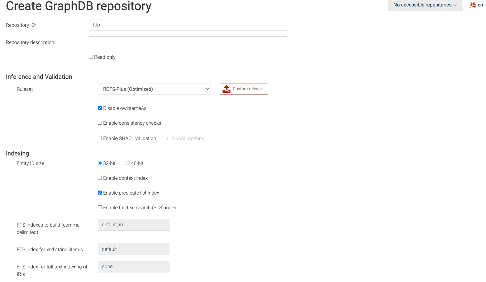
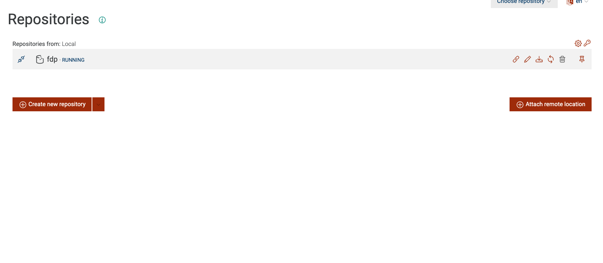
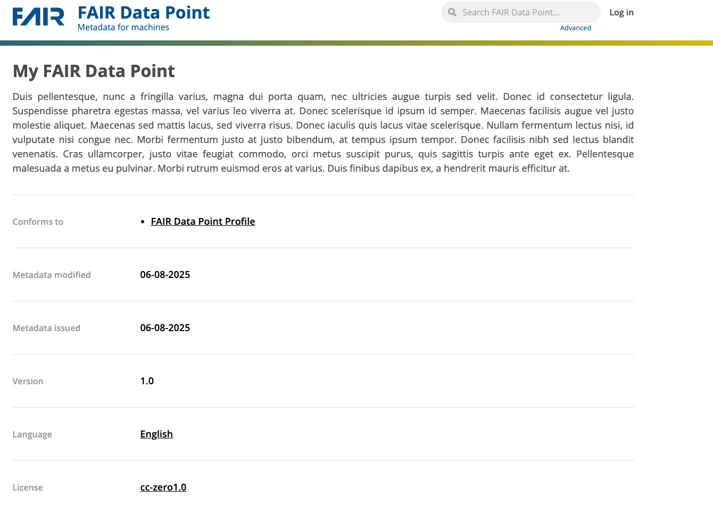

# FAIR Daya Point Setup (with reference implementation)

## Introduction 
This part of the tutorial aims at showing how it is possible to create Fair Data Point (FDP)
through the usage of the FAIR Data Point reference implementation.
The FAIR Data Point will contain metadata addessing one or more datasets created in the 
previous tutorials (e.g. OpenEHR and datamanagement/rest tutorials). 
You will have to set-up a FDP with your own data, describing: 
 - the FDP itself, 
 - the Catalogue, that contains information of the Registry, 
 - the Dataset, that contains metadata about the data in the registry, 
 - the Distribution, that contains metadata about how the data are distributed for the researchers.

## Setup and fill the fdp 
In this first part you will fill the hierarchy of the FDP with data representing your data registy.
You will run the FDP Reference Implementation (RI) in your machine and fill the Resources in the registry.
The fdp directory contains the configuration files for the FDP app. In particular the docker-compose.yml file 
sets up four different services: 
- **fdp**: the main service that runs the FDP Reference Implementation
- **fdp_client**: sets up the web app to interact woth the fdp
- **mongo**: the admin database, containing the metadata of the FDP and settings (users, ecc)
- **graphdb**: triple store database, containing the (meta)data relates to the Catalog, Dataset, Distrubition that wie'll set up

  1. To run the containers, from the fdp directory, run:
      ```bash
      docker compose up -d
      ```
      NB: the FDP runs on port 8050 and 8888: be sure to have this ports free. 
      If not, edit the port in the fdp-client service in the docker-compose.yml and in application.yml 
      the clientUrl address with the chosen port. Additionally, the docker images in the console are only compatible 
      with a linyx/amd64 environment. If you are using a different architecture, you will have to build the images from the Dockerfile
      (see reference implementation documentation at https://github.com/FAIRDataTeam/FAIRDataPoint for more details).
      Once the containers are up, we have to connect to the graph database and create the repository for the fdp. 
      Open a browser and go to http://localhost:7200 . This wwill open the GraphDB UI. On the left menu, go to "Setup"
      and then "Repositories". Click on the "Create repository" button, this will open the page to create the fdp repository. 
      Click on "Create new repository" and then on "Graph DB Repository":

      
  
      Fill only the Repository ID field as in the picture, then click on "Create" on the bottom right of the page. 
      If all went well, you should see the new repository in the list of repositories.
    
      ory, e.g. "Repository for the
    
      Now that we have created the fdp repository properly, we have to restart the fdp in a way that it can 
      run properly. From shell, do:
        ```bash
        docker compose stop fdp
        ```
     And then :
        ```bash
        docker compose start fdp
        ```
     And wait a couple of minutes. 

   
     
2.  Once the FDP is up, you can reach it via browser at http://<YOUR_IP_ADDRESS>:8050. Here  you are 
    presented with the FDP prefilled metadata: this must be edited.
        

    Login using albert.einstein@example.com / password default account

    NB: if at first you get an error message “Unable to get data”, just wait and retry, the blazegraph db 
    that stores the data takes more time to be up and running

3. The hierarchy of our FDP consists of four levels: the FDP itself, Catalogs, Datasets and Distributions. 
   Fill every level of the hierarchy the FDP metadata adding one Catalog, one Dataset and one Distribution. 
   As a general indication for filling the metadata, keep in mind that the FDP targets both humans and 
   machines, so try to be exhaustive describing the Resources: think that a user, reading your description, 
   should understand what the Resource is about. After filling the fields as indicated, click on the 
   Publish button on the upper-right side of the created Resource.
   Let's start from editing information of the FDP, Click on "Edit" on the upper-right side of the page. 
   The FDP Metadata describes the FDP. It’s the first point of contact for users to understand what type of FDP
   they are deling with.
   - i.    Give a title to the FDP: include your name in the title you use
   - ii.   Give a description of the FDP
   - iii.  Add the publisher metadata: it should be the name of an organization or a person name responsible of publishing the FAIR Data Point
   - iv.   Add the version metadata: use the semver rules: https://semver.org/
   - v.    Add the language: it has to be an IRI (i.e., a term from a controlled vocabulary). 
           One of the most used formats is ISO639-1. It is possible to use the URL defined in 
           https://id.loc.gov/: 
       1.  connect to the site 
       2.  in the home page go to the “Languages” section and select the standard ISO639-1. 
       3.  Select a language from the “Top Scheme Members”
       4.  From the page get the URI(s)
   - vi.   Add license from Creative Commons licenses (look at Appendix A)
   - vii   Set the start and end dates
   - viii. Add the language of the UI same as for the point v.
4. Add one Catalog that describes the Registry of your group. Fill the metadata as done for the FDP
5. Add one Dataset that describes the tumor cases in your registry. In addition to the common metadata, 
   for the Dataset you will need to add


