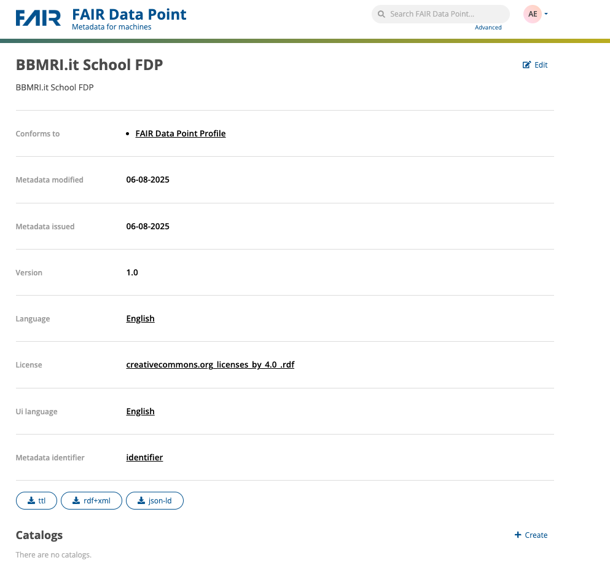
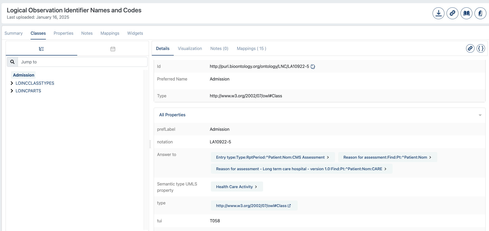

# FAIR Data Point Setup (with reference implementation)

## Introduction 
This part of the tutorial aims at showing how it is possible to create Fair Data Point (FDP)
through the usage of the FAIR Data Point reference implementation.
The FAIR Data Point will contain metadata addessing one or more datasets created in the 
previous tutorials (e.g. OpenEHR and datamanagement/rest tutorials). 
You will have to set-up a FDP with your own data, describing: 
 - the FDP itself, 
 - the Catalogue, that contains information of the Registry, 
 - the Dataset, that contains metadata about the data in the registry, 
 - the Distribution, that contains metadata about how the data are distributed for the researchers.

## Setup and fill the FDP
In this first part you will fill the hierarchy of the FDP with data representing your data registy.
You will run the FDP Reference Implementation (RI) in your machine and fill the Resources in the registry.
The fdp directory contains the configuration files for the FDP app. In particular the docker-compose.yml file 
sets up four different services: 
- **fdp**: the main service that runs the FDP Reference Implementation
- **fdp_client**: sets up the web app to interact woth the fdp
- **mongo**: the admin database, containing the metadata of the FDP and settings (users, ecc)
- **graphdb**: triple store database, containing the (meta)data relates to the Catalog, Dataset, Distrubition that wie'll set up


NB: the FDP runs on port 8050 and 8888: be sure to have this ports free. 
If not, edit the port in the fdp-client service in the docker-compose.yml and in application.yml 
the clientUrl address with the chosen port. Additionally, the docker images in the console are only compatible 
with a linyx/amd64 environment. If you are using a different architecture, you will have to build the images from the Dockerfile
(see reference implementation documentation at https://github.com/FAIRDataTeam/FAIRDataPoint for more details).

1. First, we have to set up only the graphdb container: 
```bash
docker compose up -d graphdb
```
Once the containers is up, we have to connect to the graph database and create the repository for the fdp. 
Open a browser and go to http://localhost:7200 . This wwill open the GraphDB UI. On the left menu, go to "Setup"
and then "Repositories". Click on the "Create repository" button, this will open the page to create the fdp repository. 
Click on "Create new repository" and then on "Graph DB Repository":


  
Fill only the Repository ID field as in the picture, then click on "Create" on the bottom right of the page. 
      If all went well, you should see the new repository in the list of repositories.
    
ory, e.g. "Repository for the
    
Now that we have created the fdp repository properly, we have to start all the containers of the FDP Reference Implementation.
To do this, go to the fdp directory and run the following command:
```bash
docker compose up -d
```
This will start all the containers defined in the docker-compose.yml file.
wait a couple of minutes, ina way that all the services are up and running.

   
     
2.  Once the FDP is up, you can reach it via browser at http://<YOUR_IP_ADDRESS>:8050. Here  you are 
    presented with the FDP prefilled metadata: this must be edited.
        

    Login using albert.einstein@example.com / password default account

    NB: if at first you get an error message “Unable to get data”, just wait and retry, the blazegraph db 
    that stores the data takes more time to be up and running

3. The hierarchy of our FDP consists of four levels: the FDP itself, Catalogs, Datasets and Distributions. 
   Fill every level of the hierarchy the FDP metadata adding one Catalog, one Dataset and one Distribution. 
   As a general indication for filling the metadata, keep in mind that the FDP targets both humans and 
   machines, so try to be exhaustive describing the Resources: think that a user, reading your description, 
   should understand what the Resource is about. After filling the fields as indicated, click on the 
   Publish button on the upper-right side of the created Resource.
   Let's start from editing information of the FDP, Click on "Edit" on the upper-right side of the page. 
   The FDP Metadata describes the FDP. It’s the first point of contact for users to understand what type of FDP
   they are deling with.
   - i.    Give a title to the FDP: include your name in the title you use
   - ii.   Give a description of the FDP
   - iii.  Add the publisher metadata: it should be the name of an organization or a person name responsible of publishing the FAIR Data Point
   - iv.   Add the version metadata: use the semver rules: https://semver.org/
   - v.    Add the language: it has to be an IRI (i.e., a term from a controlled vocabulary). 
           One of the most used formats is ISO639-1. It is possible to use the URL defined in 
           https://id.loc.gov/: 
       1.  connect to the site 
       2.  in the home page go to the “Languages” section and select the standard ISO639-1. 
       3.  Select a language from the “Top Scheme Members”
       4.  From the page get the URI(s)
   - vi.   Add license from Creative Commons licenses (look at Appendix A)
   - vii   About the start and end dates, leave them blank.
   - viii. Add the language of the UI same as for the point v.
   
   If all went OK, after having clicked the "Save" button, you will see the updated FDP page:
   
   
   
   Now, in our FDP we have to address, with the hyerarchy, the dataset on ./datasets, that is a 
   csv reporting sample data of patients that had episodes of admission/duscharge in a hospital, with 
   related diagnosis, tests, etc.

4. First, we have to add a Catalog: in the right bottom of the page. click on the 
   "Create" button and fill the fields as done for the FDP. Then, click on the "Save" button.
   You will see that the Catalog has been created, but in a [DRAFT] state. 
5. Now, let's add one Dataset that describes our case stusy, the dataset that we mentioned above. On the right
   bottom of the Catalos page, we have the create button to create the dataset by filling the
   related  information. The crucial thing here is to add one or mote Themes that help to 
   descriibe what the dataset is about. The concepts must be ontologized and what we will add in the 
   theme field is are the IRI of the concept. For simplicity, we will use LOINC as the reference ontology and 
   we will add as themes these concepts:

   - Admission
   - Discharge
   - Arthritis
   - Asthma
   - Cancer
   - Obesity
   - Diabetes
   - Hypertension
   
   You can search for the URIs of the concepts from: https://bioportal.bioontology.org/ontologies/LOINC?p=classes
   In the "classes" box, type the bame of the concept and click on the result that appear to 
   look at the details:
    
   Copy the ID URI and paste it in the theme field of the dataset. Do the same for tall the others.
   Finally, add a contacr point (fake email i the form of mailto:[email]) and some keywords related to the dataset, and save.

6. Add now a Distribution: the distribution describes how our datasest 
   can be accessed and the format of the Dataset. In this case we will suppose that 
   the dataset is available as a CSV file, so we will add the URL of the file in 
   out own filesystem, in the form ogf file://<path_to_file>. We can enteer this value in the 
  "Access URL" field. We will instead left blank the "Download URL" field, as we do not have a
   download URL for the file. We will also set "text/csv" as type. For all the other fields, we will do the same as in the previous pages.

7. Now, from the home page, navigate the hyerarcht of the created FDP and if all is ok, 
   publish rthe Catalog, Dataset and Distribution by ckicking on the "Publish" button on the upper-right side of each page.
## Appendix A
Table of Creative Commons licenses

| License                                            | IRI                                                                                                                                     | Description                                                                                                                                                                                                                                                               |
|----------------------------------------------------|----------------------------------------------------------------------------------------------------------------------------------------|---------------------------------------------------------------------------------------------------------------------------------------------------------------------------------------------------------------------------------------------------------------------------|
| Attribution -  CC BY                               | [Link](https://raw.githubusercontent.com/creativecommons/cc.licenserdf/main/cc/licenserdf/licenses/creativecommons.org_licenses_by_4.0_.rdf)            | It lets others distribute, remix, adapt, and build upon your work, even commercially, as long as they credit you for the original creation                                                                                                                               | 
| Attribution ShareAlike  - CC BY-SA                 | [Link](https://raw.githubusercontent.com/creativecommons/cc.licenserdf/main/cc/licenserdf/licenses/creativecommons.org_licenses_by-sa_4.0_.rdf)         | It lets others remix, adapt, and build upon your work even for commercial purposes, as long as they credit you and license their new creations under the identical terms                                                                                                 | 
| Attribution-NoDerivs -  CC BY-ND                   | [Link](https://raw.githubusercontent.com/creativecommons/cc.licenserdf/main/cc/licenserdf/licenses/creativecommons.org_licenses_by-nd_4.0_.rdf)         | This license lets others reuse the work for any purpose, including commercially; however, it cannot be shared with others in adapted form, and credit must be provided to you.                                                                                           | 
| Attribution-NonCommercial - CC BY-NC               | [Link](https://raw.githubusercontent.com/creativecommons/cc.licenserdf/main/cc/licenserdf/licenses/creativecommons.org_licenses_by-nc_4.0_.rdf)         | This license lets others remix, adapt, and build upon your work non-commercially, and although their new works must also acknowledge you and be non-commercial, they don’t have to license their derivative works on the same terms.                                     | 
| Attribution-NonCommercial-ShareAlike - CC BY-NC-SA | [Link](https://raw.githubusercontent.com/creativecommons/cc.licenserdf/main/cc/licenserdf/licenses/creativecommons.org_licenses_by-nc-sa_4.0_.rdf)      | This license lets others remix, adapt, and build upon your work non-commercially, as long as they credit you and license their new creations under the identical terms.                                                                                                  | 
| Attribution-NonCommercial-NoDerivs - CC BY-NC-ND   | [Link](https://raw.githubusercontent.com/creativecommons/cc.licenserdf/main/cc/licenserdf/licenses/creativecommons.org_licenses_by-nc-nd_4.0_.rdf)      | This license is the most restrictive of our six main licenses, only allowing others to download your works and share them with others as long as they credit you, but they can’t change them in any way or use them commercially.                                         |


