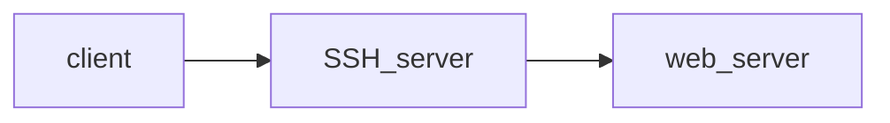
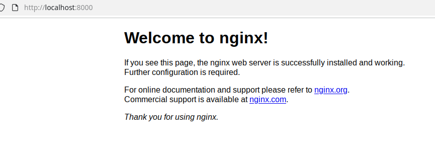
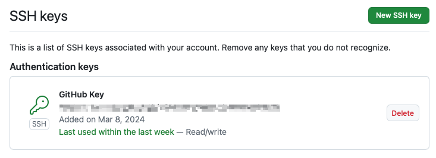
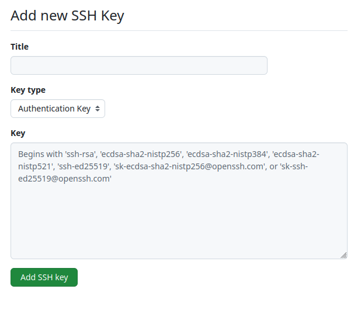

# SSH Tutorial

Prerequisites: install Docker on your system.


# Installing SSH

Install the SSH client on your system.  Below are high level instructions for various operating system.  Look for the specific instructions for your system if you don't find them below.

##  Windows

Since Windows 10 v1803+, OpenSSH client is built in.
* If not present:

        $ Add-WindowsCapability -Online -Name OpenSSH.Client~~~~0.0.1.0

Alternatively, install Git that includes OpenSSH


## MacOS

SSH is pre-installed on all modern macOS versions

If not present:

        $ /bin/bash -c "$(curl -fssl https://raw.githubusercontent.com/homebrew/install/head/install.sh)" # (install brew)
        $ brew install openssh

## Linux
SSH is usually pre-installed, but if it’s missing:

Debian/Ubuntu:

    $ sudo apt update
    $ sudo apt install openssh-client

Fedora:

    $ sudo dnf install openssh-clients

Arch:

    $ sudo pacman -S openssh


# Create your own SSH key pair

Run ssh-keygen with default parameters to create a new SSH public/private key pair.
* Will generate a key of type ed25519
* Keys will be in the files `~/.ssh/id_ed25519` (private key) and `~/.ssh/id_ed25519.pub` (public key)

Example:
```
$ ssh-keygen
Generating public/private ed25519 key pair.
Enter file in which to save the key (/root/.ssh/id_ed25519):
Created directory '/root/.ssh'.
Enter passphrase (empty for no passphrase):
Enter same passphrase again:
Your identification has been saved in /root/.ssh/id_ed25519
Your public key has been saved in /root/.ssh/id_ed25519.pub
The key fingerprint is:
SHA256:7HpJcDTJ4L1MqN5lbxmoE3vbGYn6efdba8aPy0iPTfU root@1e1ea99d6f5b

Create your own SSH key pair
The key's randomart image is:
+--[ED25519 256]--+
|      .o .       |
|     . o=        |
|      o.o.       |
|     ..+.o       |
|    . .oS .     .|
|   . . B.o +   ..|
|    . =.+.* . o E|
|       =o=.+.B *.|
|      oo+.o.o.@+o|
+----[SHA256]-----+
```


## Launch your own SSH server

To simulate a remote SSH server, launch a local (toy) SSH server in a Docker container. We have chosen the following image: <https://github.com/linuxserver/docker-openssh-server>


Start by pulling the image

    $ docker pull lscr.io/linuxserver/openssh-server:latest

Read the image’s documentation to figure out how to start the container so that you may log with both with a password and with a key (the solution is below...).


Here is the full command that you should run.  Kill the server with `Ctrl+C`:

    $ docker run --rm -p 2222:2222 -e PASSWORD_ACCESS=true -e USER_NAME=student -e USER_PASSWORD=Password -e PUBLIC_KEY="$(cat ~/.ssh/id_ed25519.key.pub)" lscr.io/linuxserver/openssh-server:latest

Command breakdown:
| | |
| --- | --- |
| `docker run` | Launch container |
| `--rm` | Delete container after execution |
| `-p 2222:2222` | Expose container port 2222 on host port 2222. Necessary to allow us to connect to the ssh server from the host |
| `-e PASSWORD_ACCESS` | -e sets an environment variable. Here we set the env. Var. PASSWORD_ACCESS to “true” to enable password access |
| `-e USER_NAME` | Configure a user account with name |
| `-e USER_PASSWORD` | Configure the password for the user account |
| `-e PUBLIC_KEY` | Read the contents of our public key file into this env variable |


With the `-p 2222:2222` option we have mapped the container's port number 2222 to the host, so that connections to the host on port 2222 will automatically be forwarded to the container.


# SSH - secure shell connection

Connect to the SSH server, with the password `Password` (as specified above):

    $ ssh -l student -p 2222 localhost


NB: the default port for SSH is 22; we are using a custom port 2222 to avoid conflicting with any real SSH servers on the same host


You can also specify the user using the `@` syntax, like this:

    $ ssh -p 2222 student@localhost


# SSH - authenticate with your key

Rather than using password authentication, you can authenticate with the key we created earlier.
* Recall: we configured our toy server to recognize the key through the `PUBLIC_KEY` environment variable.

The `-i` switch tells SSH to use the specified key to authenticate. Connect to the SSH server using your key by executing the following command:

    $ ssh -i ~/.ssh/id_ed25519.key -p 2222 student@localhost

You just logged in without typing a password!

**Note**. With this configuration, the private key is the only authentication required to access your server.  Keeping your key secret is as important as keeping a password secret.

Key based authentication has many advantages over password-based authentication.  For instance:
* convenience -- log in without typing a password;
* not susceptible to dictionary or brute force attacks;
* automatic log in -- enables automation.

When you generate a key with `ssh-keygen`, you can configure a password to secure it (i.e., encrypt it). Then, your password would protect the key and you would normally have to enter it to decrypt the key and authenticate yourself.  This strategy gives you the security of key-based authentication, but with the inconvenience of having to type a password.

Set the current SSH key aside. Repeat the exercise, this time creating a new SSH key *with a passphrase*.  Notice how you need to unlock the key to use it.


For both key-based security and password-less convenience, you can read up on using [`ssh-agent`](https://www.ssh.com/academy/ssh/agent).

After you have finished, you can restart the SSH server with the password-less key, so we can use it for the rest of this tutorial.

# SSH - passwordless logins

The previous command allowed us to login without typing a password because the Docker container is configured to recognize the key we provided on start-up.

A normal server would need to be configured for this to work.  The process is:
1. create a file `~/.ssh/authorized_keys`, if it doesn't exist;
2. add an entry for the public key to authorize
    * format has three whitespace-separated fields, on the same line: key-type pubkey comment

So, to configure a hypothetical remote server called `server.com`, you can log into it and manually add the entry to `~/.ssh/authorized_keys`.

Exercise: log into your local SSH server again and check the file `~/.ssh/authorized_keys`.  You should see something like:
```
ssh-ed25519 AAAAC3NzaC1lZDI1NTE5AAAAIOSYgWViDGYUYlVZczHOQd5VQW+rkCthHHWBseoUYns+ root@18bd4c5a056b
```
That's because the docker container initialization has automatically created the `authorized_keys` file from the settings we provided through the environment variables.

## ssh-copy-id

To configure the hypothetical `server.com`, an alternative to manually creating the `authorized_keys` file is to use the `ssh-copy-id` command, which partially automates the process:

    $ ssh-copy-id -i ~/.ssh/id_ed25519.key student@server.com


# SSH config

To avoid specifying the various connection parameters (e.g., key, custom port, IP address, etc.) you can use `~/.ssh/config` to save host connections. For instance:
```
Host myserver
    HostName localhost
    User student
    Port 2222
    IdentityFile ~/.ssh/id_ed25519.key
```

Create a file `~/.ssh/config` on your computer, with the content above, then connect to the server using the simple command below:

    $ ssh myserver

SSH config entries are also useful to specify specific usernames for specific servers.  E.g.,
```
Host github.com
    HostName github.com
    User git
    IdentityFile ~/.ssh/id_ed25519_github
```
Or to set global options for all hosts -- e.g., reuse connection:
```
Host *
    ForwardAgent yes
    ControlMaster auto
    ControlPath ~/.ssh/sockets/%r@%h:%p
    ControlPersist 10m
```

# SSH - Execute command on remote host

With SSH, in addition to opening a remote shell, you can remotely execute commands.

Execute `hostname` on the remote server and see the output locally:

    $ ssh myserver "hostname"
    6050d9aa15af

Execute `ls` on the remote server and see the output locally:

    $ ssh myserver ls
    logs
    ssh_host_keys
    sshd
    sshd.pid


# SSH Tunneling

Recall: SSH tunneling is a way to use SSH to create a "general purpose" secure network communication channel, that you can use to send data for another application (e.g., a web server, database server).

SSH tunneling has many possible uses.  E.g.,
* Bypass firewalls or NATs;
* Secure unencrypted protocols (e.g., Redis, MySQL);
* Access internal services from outside the LAN;
* Expose local service to a remote machine (reverse tunnel).

In this tutorial you'll use an SSH tunnel to access a service on a network not directly accessible from your host<sup>1</sup>.

<sup>1</sup>Actually, since the service we'll use will be running as a local Docker container, technically it is accessible, but we'll pretend it isn't for the purposes of the exercise.

## Clean up your previous SSH server

1. Kill the SSH server you created earlier
2. Delete the server key for the toy server from your client

        ssh-keygen -f $HOME/.ssh/known_hosts -R '[localhost]:2222'

## Create a new test scenario

We're going to use docker-compose to create a new test scenario where:
* we have an SSH server and a web server
* we have direct access to the SSH server, but the web server is only accessible *through* the SSH server.



This scenario is similar to what you might expect to find when you have a computing infrastructure accessible through a single SSH bastion server, with no application ports being accessible from the outside world.


Create a docker-compose containing, on the same network:
* the SSH server
* an NGINX server


A sample docker compose is provided in the [ssh](./ssh/) directory of this repository.  Download it and customize it for your needs, using what you learned in the containerization seminar.
* Note: in addition to the `docker-compose.yaml` file, there's also a configuration file required to modify the default SSH server configuration.
* Note: we're assuming you **don't already have a web server running** on port 80 on your host.

Once your docker compose file is ready, you can launch it with

    docker compose up -d

## Inspect your service

Check the IP addresses that have been assigned to your services.

Confirm the presence of the new Docker network with

    docker network ls

You should see a list that looks something like this:
```
NETWORK ID     NAME           DRIVER    SCOPE
8f4282727b32   bridge         bridge    local
47df747da497   host           host      local
21d20fa76914   none           null      local
ee15781bb7d6   ssh_tutorial   bridge    local
```
In the list you should see a network called `ssh_tutorial`.

Look at the network more closely.  Docker subcommands generally support the verb `inspect` to provide detailed information.  You can inspect your network with:

    docker network inspect ssh_tutorial

That will print out some detailed JSON.  You can use *Go templates* directly (or the [`jq` command](https://jqlang.org/manual/)) to query the JSON and extract information.

Here we use a Go template, specified with the `-f` option, to see the IP addresses assigned to our containers:
```
docker network inspect -f '{{range $id, $c := .Containers}}{{printf "%s\t%s\n" $c.Name $c.IPv4Address}}{{end}}' ssh_tutorial
openssh-server  172.18.0.2/16
web-server      172.18.0.3/16
```
Try the command on your own system and see what you get.  Also, look through the other data available through `inspect`.

Notice that our containers have been assigned addresses from the `172.18.0.0/16` subnet.  This is a [private IP](https://ipcisco.com/lesson/private-ip-address-ranges/) subnet.  These addresses are thus accessible from your host, but they are not routable on the internet and generally would not be accessible from other computers on your LAN.


## Accessing your web server

Open your browser.  Try to access your web server through `http://localhost`.  You should get an error message, like "Unable to connect".
* Reason: while the web server is running, it is not connected to the host's "main" network.  It's thus not accessible through `localhost`, nor would it be accessible through its public IP address

Test your SSH server.  Connect to it as we did before.  If you have properly customized the docker compose your previous SSH config entry should still work:

    ssh myserver
    Welcome to OpenSSH Server
    57f581289a1a:~$

Once you have confirmed that's working, exit the shell.  Notice that, in this case, we accessed the SSH server through the `localhost` network device (which we were unable to do with the web server).  If you have another node on the same LAN as your host, you should also be able to contact the SSH server from it, using the host's LAN IP address.

Now, let's get access to the web server.  Create an SSH tunnel to allow access to our web server *through* the SSH server.

Run this command:

    ssh -L 8000:web:80 myserver -N

Command breakdown:
| | |
| --- | --- |
| `-L` | Forward a local port |
| `8000:` | Local port to be forwarded |
| `web:80` | Destination: connections to the selected local port will be forwarded to a server called `web` on its port `80` |
| `myserver` | SSH server. That's the entry in our SSH config |
| `-N` | Rather than opening a shell, just run the tunnel.  **Close the tunnel with `Ctrl+C`** |


You should see that the SSH command just seems to hang, but it's actually active and the tunnel should be open.  Therefore, any connections to port `8000` on your host machine should be forwarded to port 80 of the service called `web` in our docker compose (because the SSH server sees it with that name, as it's defined in the `docker-compose.yaml` file).

Test it out.  Open your browser and point it to `http://localhost:8000`.  You should see a web page like this one:



If you see this screen, you have successfully completed the exercise.


# GitHub via SSH

You can use SSH as a transport for Git (i.e., as the channel through which Git transfers data).  Coupled with your SSH key, this strategy allows for key-based authenticated access to repositories (potentially password-less).

Enable this feature for your GitHub account. Point your browser to <https://github.com/settings/keys> (log in if you haven't already).



Select "New SSH key" at the top right.
Paste the contents of your *public* SSH key file into the appropriate text box, and give it a descriptive name in the "Title" field.  Complete the process by clicking "Add SSH key".



## Cloning a repository

Now that you have set up SSH access, you can clone a GitHub repository via SSH.

For example, you can clone the course tutorials repository:

```bash
git clone git@github.com:crs4/bbmri-it-school-tutorials.git
```

# SSH - scp (Secure Copy Protocol)

The `scp` command is a simple and secure way to transfer files between your local machine and a remote server, or vice versa. It is built on top of SSH, ensuring that all data is encrypted during transfer.

## Transfer a file to a remote server

To copy a file from your local machine to a remote server, use the following command:

```bash
scp bbmri-it-school-tutorials/README.md student@localhost:/tmp/README.md
```

where:

* `bbmri-it-school-tutorials/README.md` is the source file on your local machine.
* `student@localhost:/tmp/README.md` specifies the destination path on the remote server, including the username (`student`), the server address (`localhost`), and the target directory (`/tmp/README.md`).

> **📝 Note**
`scp` leverages the SSH configuration defined in the system's `~/.ssh/config` file. If a configuration entry exists for the target machine, it will automatically use the associated username, port, and authentication method (e.g., key). This eliminates the need to specify these parameters manually for each command.

After running this command, the file `README.md` will be securely transferred to the `/tmp` directory on the remote server.

#### Verify the file on the remote server

Once the file is transferred, you can verify its contents by running a remote `cat` command:

```bash
ssh student@localhost "cat /tmp/README.md"
```

This command connects to the remote server and displays the contents of the file directly in your terminal.

## Transfer a file from a remote server to your local machine

To copy a file from the remote server back to your local machine, use the following command:

```bash
scp student@localhost:/tmp/README.md ./tmp/README.md
```

where:

* `student@localhost:/tmp/README.md`: Specifies the source file on the remote server. It includes the username (`student`), the server address (`localhost`), and the file path (`/tmp/README.md`).
* `./tmp/README.md`: Specifies the destination path on your local machine.

After running this command, the file `README.md` will be securely transferred to the `./tmp` directory on your local machine.

#### Verify the file on your local machine

Once the file is transferred, you can verify its contents locally by running:

```bash
cat ./tmp/README.md
```

This command displays the contents of the file directly in your terminal, confirming that the transfer was successful.

## Transfer a folder from your local machine to a remote server

To copy a folder from your local machine to a remote server, use the `-r` (recursive) option:

```bash
scp -r bbmri-it-school-tutorials/ student@localhost:/tmp/
```

This command will securely transfer the entire `bbmri-it-school-tutorials` directory and its contents to the `/tmp` directory on the remote server.

#### Verify the folder on the remote server

Once the folder is transferred, you can verify its contents by running a remote `ls` command:

```bash
ssh student@localhost "ls -l /tmp/bbmri-it-school-tutorials"
```

This command connects to the remote server and lists the contents of the transferred directory.

## Additional notes (scp)

Common useful options:

* Non-standard port: `-P 2222` (if you have a host entry in `~/.ssh/config` you do not need to specify it each time)
* Specific identity file: `-i ~/.ssh/id_ed25519`
* Compression (useful on slow links / text): `-C`
* Preserve permissions and timestamps: `-p`
* Verbose (debug): `-v` (repeatable: `-vv`, `-vvv`)
* Quiet: `-q`
* Limit bandwidth: `-l 500` (in Kbit/s)

Examples:

```bash
# Copy to server on port 2222
scp -P 2222 file.txt student@localhost:/remote/path/

# Copy a directory preserving permissions and times
scp -rp dir/ student@localhost:/remote/path/

# Compressed and verbose copy using host defined in ~/.ssh/config (e.g., "myserver")
scp -Cv dir/file.log myserver:/var/logs/

# Use an alternate key
scp -i ~/.ssh/id_ed25519_github README.md myserver:/tmp/
```

Wildcards (expanded locally):

```bash
scp logs/*.gz myserver:/var/log/archive/
```

<div class="tip" style="padding: 20px;">
    <span class="icon" aria-hidden="true">💡</span>
    <strong>Tip:</strong> For repeated synchronizations or large directory trees prefer <code>rsync -e ssh ...</code> (more efficient: transfers only differences).
</div>

# SSH - sftp (SSH File Transfer Protocol)

SFTP (SSH File Transfer Protocol) is a secure file transfer protocol that runs over an SSH session, using the same port, encryption, and authentication (users, keys). It supports both interactive file management and scripted (batch) transfers.

## When to use sftp vs scp

Use sftp when you need:

* Directory navigation before deciding what to transfer
* Resumable transfers (reget/reput)
* Multiple operations over a single persistent session

Use scp for quick single known copy operations.

## Interactive session

Connect (port from earlier example via config entry myserver, or explicit):

```
sftp student@localhost
# or (uses ~/.ssh/config entry)
sftp myserver
# or explicit port
sftp -P 2222 student@localhost
```

Prompt becomes `sftp>`. Common commands:

Remote vs local:

* `ls` / `pwd` / `cd`: remote listing, working directory change
* `lls` / `lpwd` / `lcd`: local equivalents
* `get file`: download file
* `put file`: upload file
* `get -r dir`: recursive download
* `put -r dir`: recursive upload
* `mget *.log`: multiple download (wildcards expanded remotely)
* `mput *.txt`: multiple upload
* `reget file`: resume download (if partially transferred)
* `reput file`: resume upload
* `rm` / `rmdir` / `mkdir`: manage remote files and directories
* `rename old new`: rename a file or directory
* `chmod 644 file`: change file permissions (server permitting)
* `help` (or `?`): list available commands
* `exit` / `bye` / `quit`: leave the session

Example (download then verify locally):

```
sftp> lcd /tmp
sftp> get /var/log/ssh.log
sftp> bye
cat /tmp/ssh.log
```

## One‑off (non‑interactive) transfers

Assuming you have already cloned the course repository (see the section [GitHub via SSH](#github-via-ssh)), you can perform one‑off SFTP transfers directly from the terminal without entering the interactive prompt. Below are examples of simple download and upload operations using non‑interactive sftp.

Download:

```
sftp student@localhost:/tmp/bbmri-it-school-tutorials/README.md /tmp/README.md
```

Do some changes to the file, e.g. `sed -i 's/BBMRI IT School Tutorials/BBMRI IT School Tutorials 2025/g' /tmp/README.md`

Upload:

```
sftp /tmp/README.md student@localhost:/tmp/bbmri-it-school-tutorials/README.md
```

Check the changes:

```bash
ssh student@localhost "cat /tmp/bbmri-it-school-tutorials/README.md"
```

## Batch mode (scripted)

For automated or scripted transfers, `sftp` can read commands from a batch file. This is useful for running unattended jobs, such as backups or deployments.

Let's create a simple batch file that uploads a local file, renames it on the remote server, and then downloads it back.

1. **Create a local test file** to upload:

    ```bash
    echo "This is a test file for SFTP batch mode." > local_test_file.txt
    ```

2. **Create the batch file** named `sftp_batch_commands.txt` with the following content. This script will upload our test file, rename it, and then download it back to the local machine with a new name.

    ```
    # sftp_batch_commands.txt: Upload, rename, and download a file.
    put local_test_file.txt
    rename local_test_file.txt remote_test_file.txt
    get remote_test_file.txt downloaded_test_file.txt
    bye
    ```

3. **Execute the batch transfer** using the `-b` option. We'll use the `myserver` alias from our SSH config:

    ```bash
    sftp -b sftp_batch_commands.txt myserver
    ```

    * The `-b` flag tells `sftp` to read commands from the specified file instead of entering an interactive session.
    * For debugging, you can add `-v`. To suppress the progress meter and other output, use `-q`.

4. **Verify the result** on both the remote and local machines:

    First, check that the file was uploaded and renamed on the remote server:

    ```bash
    ssh myserver "ls -l remote_test_file.txt"
    ```

    You should see the file `remote_test_file.txt` listed.

    Next, verify that the file was downloaded to your local machine:

    ```bash
    cat downloaded_test_file.txt
    ```

    This should display the content "This is a test file for SFTP batch mode.", confirming the entire batch process was successful.

## Resuming a large transfer

Inside interactive session:

```

reget bigfile.iso   # resume download
reput bigfile.iso   # resume upload

```

## Common options

* -P <port>         non-standard port (capital P unlike ssh)
* -i <identityfile> select key
* -b <file>         batch mode commands
* -q                quiet
* -C                compression
* -r                recursive (when used with get / put)
* -v / -vv / -vvv   verbose debug

## Quick examples

Upload recursively:

```

sftp -P 2222 -i ~/.ssh/id_ed25519 -b - student@localhost <<'EOF'
mkdir /tmp/project
cd /tmp/project
put -r ./local-project
bye
EOF

```

Download a directory (interactive):

```

sftp myserver
sftp> get -r /var/www/html ./site-backup
sftp> bye

```

# rsync

Rsync is a powerful tool for synchronizing files and directories between two locations over SSH. It is often faster than SFTP for large transfers because it only transfers the differences between the source and destination.

## Basic usage

To use rsync over SSH, you can use the following command structure:

```bash
rsync -avz -e "ssh -p <port>" <source> <user>@<host>:<destination>
```

* `-a`: Archive mode (preserves permissions, timestamps, etc.)
* `-v`: Verbose output
* `-z`: Compress file data during transfer
* `-e`: Specify the remote shell to use (in this case, SSH)

## Example

Suppose you want to synchronize the local git repo `/tmp/bbmri-it-school-tutorials` with the remote git repo `student@localhost:/tmp/bbmri-it-school-tutorials`. You can use the following command:

```bash
rsync -avz -e "ssh -p 2222" /tmp/bbmri-it-school-tutorials/ student@localhost:/tmp/bbmri-it-school-tutorials/
```

This command will copy all files from the local git repo to the remote git repo, preserving their attributes and only transferring the differences if the command is run multiple times.

### Delete option

Let's try to delete the `README.md` file from the local repository and then synchronize the changes to the remote repository. If we use the `--delete` option, rsync will remove files from the destination that are no longer present in the source.

```bash
rm /tmp/bbmri-it-school-tutorials/README.md
rsync -avz --delete -e "ssh -p 2222" /tmp/bbmri-it-school-tutorials/ student@localhost:/tmp/bbmri-it-school-tutorials/
```

We can use `sftp` in batch mode to check the remote repository and confirm that the `README.md` file has been deleted:

```bash
sftp -b - myserver <<EOF
ls /tmp/bbmri-it-school-tutorials/
EOF
```

The `README.md` file should no longer be listed in the output.

# Rclone

Rclone is a command-line program to manage files on cloud storage. It supports over 40 different cloud storage providers, including Google Drive, Dropbox, OneDrive, Amazon S3, and many others. Rclone can be used to sync files and directories between your local machine and cloud storage, as well as between different cloud storage providers.

## Installation

To install rclone, you can follow the instructions on the [official rclone website](https://rclone.org/downloads/).

## Configuration

To use rclone, you first need to configure it with your cloud storage provider's credentials. This can be done using the `rclone config` command, which will guide you through the setup process.

### Configure a Google Drive remote

In the following examples, we will use Google Drive as our remote storage provider.

To configure a Google Drive remote, run the following command:

```bash
rclone config
```

Follow the prompts to create a new remote and select "Google Drive" as the storage type. You will need to authenticate with your Google account and grant rclone access to your Drive.

## Basic usage

Once configured, you can use rclone commands to perform various file operations. The basic syntax is as follows:

```bash
rclone <command> <source> <destination>
```

In the following examples, we assume that you have already configured a Google Drive remote named **"gdrive"**.

### List files in a remote directory

The `ls` command lists the contents of a remote directory. For example:

```bash
rclone ls gdrive:
```

### Copy files to a remote directory

Use the `copy` command to transfer files from your local machine to a remote location. The following example uploads a local file to a folder on Google Drive:

```bash
rclone copy /path/to/local/file.txt gdrive:folder/
```

### Copy files from a remote directory

To download files, simply reverse the source and destination arguments. This command copies a file from Google Drive to a local directory:

```bash
rclone copy gdrive:folder/file.txt /path/to/local/
```

### Synchronize a local directory with a remote directory

The `sync` command makes a remote directory identical to a local one, transferring only the necessary changes.

```bash
rclone sync /path/to/local/dir gdrive:folder
```

### Many other commands

Rclone offers a wide range of commands for managing files and directories on cloud storage. Some of the most commonly used commands include:

* `mkdir`: Create a new directory on the remote storage.
* `delete`: Remove a file or directory from the remote storage.
* `move`: Move a file or directory from one location to another on the remote storage.
* `copyto`: Copy a file to a specific location on the remote storage.
* `lsd`: List directories in a remote path.
...

You can find a complete list of commands and their usage in the [official rclone documentation](https://rclone.org/commands/).
