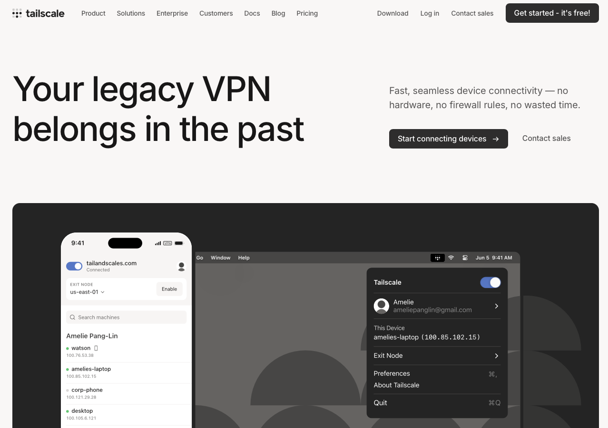
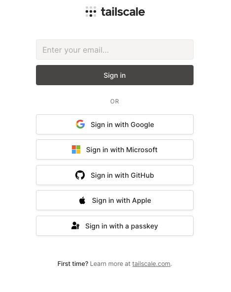
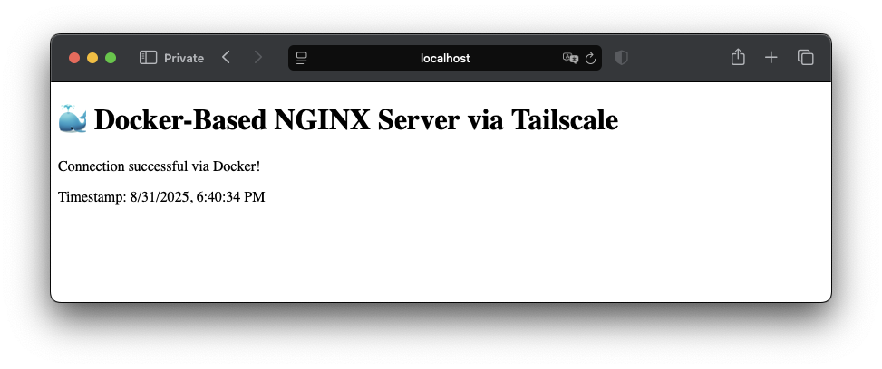
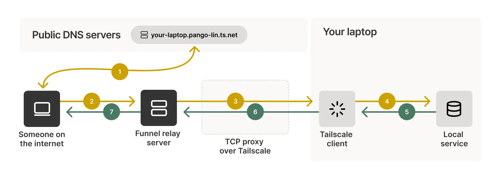
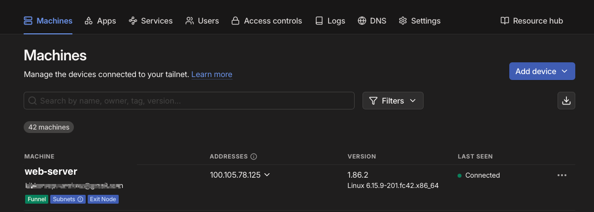

# Secure remote services with Tailscale and TLS

This tutorial provides an introductory guide to establishing secure communication between devices, regardless of their network or location. By leveraging Tailscale and WireGuard, you will create a private, encrypted network that seamlessly connects your devices. The tutorial also explores TLS certificate generation, starting with the simplest approach using Tailscale's managed certificates, and progressing to Certbot for more advanced scenarios, enabling secure communication with remote services through both automated and manual certificate setups.

## Prerequisites

Before beginning this tutorial, ensure your environment meets the following requirements:

**Hardware Requirements:**

- A laptop or desktop computer with either WiFi or Ethernet connection
- A mobile device (smartphone or tablet) with cellular data or WiFi capability
- **Optional but recommended**: A secondary device for testing (another laptop, Raspberry Pi, or virtual machine)

**Software Requirements:**

- **Docker Engine** (version 20.10 or later) installed and running on your primary machine
- **Docker Compose** (version 2.0 or later) for orchestrating multi-container applications
- A modern web browser (Chrome, Firefox, Safari, or Edge)
- Administrative privileges on your devices for software installation

**Network Requirements:**

- Stable internet connection on all devices
- Ability to install software on your devices (not restricted by corporate policies)
- **Note**: No specific firewall configuration or port forwarding is required—Tailscale handles NAT traversal automatically

## 1. Tailscale Setup and Configuration

In this first section, we'll establish the foundation for secure remote communication by setting up Tailscale across your devices. This configuration will serve as the **secure network backbone** for some of the activities covered in the next steps of this tutorial.

By the end of this section, you'll have:

- A **private mesh network** connecting your laptop, mobile device, and any additional machines
- **Automatic DNS resolution** allowing devices to find each other by name (e.g., `laptop-work.tailnet.ts.net`)
- **Encrypted communication channels** between all devices using WireGuard protocol
- A **network foundation** for hosting and accessing secure web services

### 1.1 Account Registration

To establish your secure network, you'll first need a Tailscale account. Tailscale offers several authentication options and pricing tiers to suit different needs:

1. **Navigate to Tailscale Registration**: Visit [tailscale.com](https://tailscale.com) and click on the prominent "Get started - it's free!" button.

<p align="center">
  <br/>
  <em>Tailscale home page</em>
</p>

2. **Choose Your Authentication Method**: Tailscale supports multiple identity providers for seamless integration:

<table>
<tr>
<td width="50%">

- **Google Account**: Ideal for personal use and small teams  
- **Microsoft Account**: Perfect for organizations using Microsoft 365  
- **GitHub Account**: Popular among developers and technical teams  
- **Apple ID**: Convenient for users in the Apple ecosystem  
- **Passkey Authentication**: A modern, passwordless authentication method for enhanced security  
- **SSO Options**: Enterprise customers can integrate with existing identity providers  
- **Email/Password**: Traditional authentication method  

<strong>Security Note:</strong> Tailscale uses your chosen identity provider for authentication, meaning you benefit from their security measures including two-factor authentication. We strongly recommend enabling 2FA on your chosen provider for enhanced security.
</td>

<td width="50%">

<div align="center">

<br/>
</div>

</td>
</tr>
</table>

3. **Select the Personal Plan**: Free for up to 3 users and 100 devices—perfect for this tutorial

### Initial Account Setup

After successful registration, you'll be redirected to the Tailscale admin console where you can:

- **Review your tailnet name**: This is your private network identifier (e.g., `mynetwork.ts.net`). You can verify your tailnet name in the Tailscale admin console under the "DNS" section.
- *optionally*:
  - **Configure basic settings**: Set up your network preferences and security policies
  - **Generate authentication keys**: For automated device enrollment (we'll cover this in advanced sections)
  - etc..

## 1.2 Tailscale Client Installation and Device Setup

Installing Tailscale across your devices is straightforward thanks to its cross-platform compatibility. The following instructions will guide you through the installation process for each major operating system, along with troubleshooting tips and best practices.

### Desktop/Laptop Installation

#### For Linux Systems

**Automatic Installation (Recommended):**

```bash
curl -fsSL https://tailscale.com/install.sh | sh
```

This intelligent installation script automatically:

- Detects your Linux distribution (Ubuntu, Debian, CentOS, RHEL, Fedora, SUSE, etc.)
- Downloads the appropriate package for your system architecture
- Configures the repository for automatic updates
- Installs Tailscale with proper system integration

**Manual Installation Options:**
For users who prefer manual control or are on air-gapped systems:

- **Ubuntu/Debian**: Download the `.deb` package from [tailscale.com/download](https://tailscale.com/download)
- **RHEL/CentOS/Fedora**: Download the `.rpm` package
- **Arch Linux**: Install from AUR: `yay -S tailscale`

#### For macOS

**Using Homebrew (Recommended for developers):**

```bash
brew install tailscale
```

**Using the Mac App Store:**
Search for "Tailscale" in the Mac App Store for a user-friendly GUI experience with automatic updates.

**Direct Download:**
Download the `.pkg` installer from [tailscale.com/download](https://tailscale.com/download) for systems without Homebrew.

#### For Windows

**GUI Installer (Recommended for most users):**

1. Download the Tailscale installer from the [official website](https://tailscale.com/download)
2. Run the `.msi` installer as Administrator
3. Follow the installation wizard prompts
4. The installer will automatically start the Tailscale service

**Package Managers:**

- **Chocolatey**: `choco install tailscale`
- **Winget**: `winget install tailscale.tailscale`

### Service Activation and Authentication

After installation on any desktop platform, activate Tailscale:

```bash
sudo tailscale up
```

**What happens during activation:**

1. Tailscale generates a unique authentication URL
2. Your default browser opens automatically
3. You'll be prompted to sign in with your chosen identity provider
4. The device receives its Tailscale IP address (in the 100.x.y.z range)
5. Your device joins the tailnet and becomes discoverable

**Authentication Options:**

- **Interactive mode** (default): Opens browser for manual authentication
- **Auth key mode**: For automated deployments using pre-generated keys
- **Headless mode**: For servers without GUI access

### Mobile Device Installation

#### Android Devices

1. **Download**: Install from [Google Play Store](https://play.google.com/store/apps/details?id=com.tailscale.ipn) or download the APK directly for devices without Google Services
2. **Setup**: Open the app and tap "Sign in with Tailscale"
3. **Authentication**: Use the same account credentials from your laptop setup
4. **Permissions**: Grant VPN permissions when prompted (required for secure tunneling)

#### iOS Devices

1. **Download**: Install from [Apple App Store](https://apps.apple.com/app/tailscale/id1470499037)
2. **Setup**: Launch the app and select "Sign in"
3. **VPN Configuration**: iOS will prompt to add VPN configuration—tap "Allow"
4. **Biometric Authentication**: Enable Face ID/Touch ID for convenient connection management

### Device Authorization and Network Management

Once all devices are installed and authenticated, you'll need to authorize them in your Tailscale network:

#### Using the Admin Console

1. **Access Admin Console**: Navigate to [login.tailscale.com](https://login.tailscale.com)
2. **View Devices**: Click on the "Machines" tab to see all connected devices
3. **Authorize Devices**: For each new device:
   - Click the device name to view details
   - Click "Authorize machine" if it shows as pending
   - Optionally, assign a friendly name (e.g., "John's Laptop", "Development Server")

#### Device Management Best Practices

**Naming Convention:**

- Use descriptive names: `laptop-work`, `phone-personal`, `server-production`
- Include owner information for shared networks: `alice-macbook`, `bob-android`

**Security Settings:**

- **Key Expiry**: Set appropriate key expiration periods (90 days default)
- **Device Approval**: Enable device approval for sensitive networks
- **Subnet Routing**: Configure if you need access to local network resources

### Verification and Testing

After authorization, verify your setup:

#### Check Device Status

With the `tailscale status` command, you can view the current status of your Tailscale connection:
Your device's Tailscale IP address, all other devices in your network, the connection status and last seen times, and relay usage (DERP servers) if direct connection isn't possible.

```bash
$ tailscale status
# Health check:                        OK
# Your Tailscale IP:                   100.79.0.1
# MagicDNS domains:                    enabled
# Device name:                         laptop-work
# NetMap:                              4 peers total

100.79.0.1  laptop-work          linux   idle      -
100.79.0.2  phone-personal       android active    direct 10ms
100.79.0.3  raspberrypi-media    linux   active    relay  42ms  (derp9)
100.79.0.4  server-prod          linux   active    direct 18ms  subnet-routes:192.168.1.0/24

```

Each row contains the following information:

- **Tailscale IP** – Private address (100.x.y.z range) assigned by the tail net  
- **Hostname** – Device name displayed in the admin console; can be renamed for clarity  
- **OS** – Detected operating system (linux, android, windows, macOS, etc.)  
- **Status** –  
  - `active` – device is currently connected  
  - `idle` – device was recently connected but is now in standby  
- **Connection** – How traffic is routed  
  - `direct` – peer-to-peer link with estimated round-trip latency (e.g., 10 ms)  
  - `relay` – traffic goes through a DERP relay; the relay ID and latency are shown in parentheses  
- **Extra** – Additional information, such as  
  - `subnet-routes:192.168.1.0/24` – device is advertising a local subnet  
  - `exit-node` – device is acting as an exit node for Internet traffic

#### Test Connectivity

```bash
# Ping another device using its Tailscale IP
ping 100.x.y.z

# Test using device name (MagicDNS)
ping device-name
```

### Troubleshooting Common Issues

**Connection Problems:**

- **Firewall blocking**: Ensure UDP port 41641 is allowed
- **Corporate networks**: Some corporate firewalls block VPN traffic
- **Solution**: Tailscale automatically falls back to HTTPS relay servers

**Authentication Issues:**

- **Browser doesn't open**: Manually copy the authentication URL
- **Multiple accounts**: Ensure you're using the same identity provider across devices
- **Expired sessions**: Run `tailscale logout` and `tailscale up` again

**Performance Optimization:**

- **Direct connections**: Tailscale prefers direct peer-to-peer connections
- **Relay usage**: Check `tailscale netcheck` for optimal relay server selection
- **Subnet conflicts**: Avoid IP range conflicts with local networks

Your devices are now securely connected through Tailscale's encrypted mesh network, ready for the next phase of configuration!

## 2 · Start an NGINX Web Server with Docker

In this preliminary step we’ll spin up a lightweight, container-based web server that will later be reached over the Tailscale network. Running NGINX in Docker keeps the host clean and makes the setup fully reproducible.

***

### 2.1 · Create the project skeleton

```bash
# Create parent folder plus sub-directories for HTML and future config
mkdir -p ~/tailscale-tutorial/{html,nginx-config}
cd ~/tailscale-tutorial
```

***

### 2.2 · Add a quick test page

```bash
cat > html/index.html <<'EOF'
<!DOCTYPE html>
<html>
    <head>
        <meta charset="UTF-8" />
        <title>NGINX Server via Tailscale (Docker)</title>
        <link
            rel="icon"
            href="data:image/svg+xml,<svg xmlns='http://www.w3.org/2000/svg' viewBox='0 0 100 100'><text y='.9em' font-size='90'>🐳</text></svg>"
        />
    </head>
    <body>
        <h1>🐳 Docker-Based NGINX Server via Tailscale</h1>
        <p>Connection successful via Docker!</p>
        <p>Timestamp: <span id="timestamp"></span></p>
        <script>
            document.getElementById("timestamp").textContent =
                new Date().toLocaleString();
        </script>
    </body>
</html>
EOF
```

What this does  

- Saves a minimal HTML page inside `~/tailscale-tutorial/html`.  
- Inserts a live timestamp each time the page is loaded, making it obvious when the response is fresh.

***

### 2.3 · Define the Docker service

Create `docker-compose.yml`:

```yaml
services:
  nginx:
    image: nginx:alpine          # 5 MB image with the full NGINX package
    container_name: tailscale-nginx
    ports:
      - "80:80"                  # Expose port 80 on the host
    volumes:
      - ./html:/usr/share/nginx/html:ro   # Serve our page read-only
    restart: unless-stopped
```

Key choices  

- **nginx:alpine** — compact, fast to pull.  
- **restart: unless-stopped** — auto-starts after reboot unless you explicitly stop it.

***

### 2.4 · Launch the container

```bash
docker-compose up -d

[+] Running 8/8
 ✔ nginx Pulled                                                                                             7.7s 
   ✔ 49f3b06c840f Pull complete                                                                             1.5s 
   ✔ 0bc2f07fbf03 Pull complete                                                                             0.9s 
   ✔ 6c2c01fdb094 Pull complete                                                                             0.7s 
   ✔ 021cb5923c0e Pull complete                                                                             2.5s 
   ✔ 66ce170f7dd8 Pull complete                                                                             0.6s 
   ✔ 04ba7957f9d2 Pull complete                                                                             0.8s 
   ✔ 6156ecb6dfff Pull complete                                                                             0.4s 
[+] Running 2/2
 ✔ Network tailscale-tutorial_default  Created                                                              0.0s 
 ✔ Container tailscale-nginx           Started                                                              0.1s

```

Docker will:  

1. Pull the Alpine-based NGINX image (only on first run).  
2. Mount your `html` folder into the container.  
3. Start NGINX in detached mode.

Verify it locally:

```bash
curl http://localhost
```

<p align="center">
  
  <br/>
  <em>Screenshot of the Dockerized NGINX page</em>
</p>

You should see the “Docker-Based NGINX Server via Tailscale” banner along with the current timestamp. Your web server is now ready to be exposed through the encrypted Tailscale network in the next section.

## 3 · Expose the Web Server with Tailscale HTTPS (Managed Approach)

Tailscale offers a managed TLS solution that eliminates the complexity of certificate management. This approach uses Tailscale's **Serve** and **Funnel** features to automatically handle:

- **TLS certificate provisioning** via Let's Encrypt  
- **Certificate renewal** (automatic, zero-touch)  
- **TLS termination** at Tailscale's edge infrastructure  
- **Public Internet exposure** (optional, via Funnel)

This managed approach means you can publish an internal service to the Internet **without**:

- Opening inbound firewall ports
- Buying or managing certificates manually
- Running a reverse-proxy like Caddy or Traefik
- Configuring your web server for HTTPS

> **💡 When to use this approach:**
>
> - Quick prototyping and demos
> - Development and testing environments
> - Small-scale personal projects
> - Scenarios where you want zero certificate management overhead

Below we'll configure both **private tailnet access** and **public Internet access** for the Docker-based NGINX server from Section 2.

***

### 3.1 · What “TLS termination” actually is

When a browser connects to an HTTPS site it performs a TLS handshake, encrypting everything after that point.  
A **TLS terminator** is the component that:

1. Presents a valid certificate for the requested domain.  
2. Negotiates the TLS session with the client.  
3. Decrypts the traffic and forwards the clear-text HTTP to the upstream service.

By off-loading TLS at the edge you:

- simplify certificate management (one place to renew)  
- keep your backend configuration identical to plain HTTP  
- gain modern cipher suites without touching the application container  

Tailscale’s **`serve`** HTTPS feature works exactly like a managed reverse-proxy: it terminates TLS on Tailscale-controlled infrastructure, then tunnels the decrypted connection over WireGuard to the service running inside your tailnet.

```
┌────────────┐       TLS (443)      ┌─────────────┐  WireGuard  ┌────────────┐
│  Browser   │ ───────────────────▶ │ TLS Edge @  │ ───────────▶│   Your     │
│  Worldwide │       Internet       │ Tailscale   │  encrypted  │   Host     │
└────────────┘                      └─────────────┘             │  NGINX 80  │
                                                                └────────────┘
```

1. The browser establishes an encrypted TLS session with Tailscale’s edge.  
2. Tailscale decrypts, then re-encrypts inside the WireGuard tunnel to your device.  
3. Your local NGINX receives plain HTTP on port 80, just like it would on LAN.  
4. Return traffic follows the same path in reverse.

All legs are encrypted: TLS externally, WireGuard internally.

***

### 3.2 · Prerequisites

- Your NGINX container from Section 2 is up and responding on port 80.  
- You have **owner** or **network admin** rights in the tailnet.  
- A stable public IP isn’t required—Tailscale handles that via its global DERP relay and DNS infrastructure.

***

### 3.3 · Enable HTTPS serving for the host within the Tailscale network

1. Make sure the machine running Docker is **already signed-in to Tailscale** and shows as `active` in `tailscale status`.  
2. From that host, run:

```bash
# Enable the built-in web server functionality and request a public hostname
sudo tailscale serve http://localhost:80
```

What this command does:

| Step | Behind the scenes |
|------|------------------|
| 1 | Generates or reuses an **FQDN** like `device-name.mynetwork.ts.net` |
| 2 | Requests a **Let’s Encrypt** certificate for that name |
| 3 | Opens an HTTPS listener on port 443 of the Tailscale interface |
| 4 | Forwards decrypted traffic to the local service at `http://localhost:80` |

You’ll see output similar to:

```bash
Available within your tailnet:

https://web-server.mynetwork.ts.net/
|-- proxy http://localhost:80

Press Ctrl+C to exit.
```

You can test the setup by accessing the service from another device in your tailnet:

- from a Web browser, navigate to `https://web-server.mynetwork.ts.net/`

- from a Windows/Linux/Mac terminal:

```bash
curl -I https://web-server.mynetwork.ts.net/
```

***

### 3.4 · Publish your local service to the Internet with **Tailscale Funnel**

Tailscale **Funnel** takes what you configured in step **3.3** (HTTPS terminated by Tailscale and forwarded to your local service) and **opens it to the public Internet**. With Funnel enabled, anyone on the Internet can reach your chosen hostname (e.g., `web-server.mynetwork.ts.net`) over HTTPS, and traffic is carried securely over Tailscale's WireGuard tunnel to your machine.

<p align="center">
  
  <br/>
  <em>How Tailscale Funnel works</em>
</p>

> **When to use it**
>
> - Demo a local app to a client without deploying it
> - Share a dashboard from your laptop/server temporarily
> - Publish a low‑traffic personal site without reverse‑proxy or firewall changes
>
> **When *not* to use it**
>
> - High‑traffic or mission‑critical production sites (Funnel is designed for convenience, not as a high‑capacity CDN)

#### Prerequisites & safety checklist

- You are **Owner** or **Network admin** of the tailnet, or your device is allowed to use Funnel.
- You understand this makes the service **publicly reachable**. If you only want tailnet‑private access, **do not** enable Funnel.

#### Enable Funnel

Tailscale Funnel is disabled by default, but you can enable it easily through the Tailscale command `tailscale funnel`. The first time you enable Funnel, the command triggers a web interface that prompt you to confirm the its activation.

To expose the NGINX service running on port 80 to the Internet:

```bash
sudo tailscale funnel 80

Available on the internet:

https://web-server.mynetwork.ts.net/
|-- proxy http://127.0.0.1:80

Press Ctrl+C to exit.
```

#### Verify from *anywhere*

You can test it from any other device outside the Tailscale network as well as outside the local network to which the laptop/server belongs. This includes any device connected to the Internet (e.g., a smartphone connected via cellular network with WiFi disabled).

From **any device, even outside your tailnet**:

```bash
curl -I https://web-server.mynetwork.ts.net
```

Expected response:

```text
HTTP/2 200
server: nginx/1.25.x
content-type: text/html
...
```

Then open the same URL in a browser—you should see the test page with a **padlock**. The certificate is issued by **Let’s Encrypt** and is auto‑renewed by Tailscale.

#### Verify Funnel status

The current status of Funnel can always be verified by running from the Admin console, where devices in the network with Funnel active will display a green badge.

<p align="center">
  
  <br/>
  <em>Tailscale Admin Console:</em> the green badge indicates Funnel is active
</p>

You can also verify the status from the command line:

```bash
tailscale funnel status
```

Typical `tailscale funnel status` output will show `443: on` when enabled. If you see **not allowed**, your device/tag must be granted Funnel permission by an admin in the console.

<!-- #### Troubleshooting

- **`tailscale funnel status` shows `not allowed`:** Ask a tailnet admin to enable Funnel for your device (or for a device tag you advertise). You can advertise tags on the device with `tailscale up --advertise-tags=tag:web-public` and then allow that tag to use Funnel in the admin console.
- **Browser shows cert/hostname errors:** Wait a minute for issuance/propagation; verify you requested the correct domain and that the device stayed online during issuance.
- **Edge returns 404/Bad Gateway:** Confirm your local service is healthy: `curl -I http://localhost:80`. Also run `tailscale serve status` to verify path mappings.
- **No inbound firewall changes:** That’s expected—Funnel works through Tailscale’s edge and WireGuard tunnel, so you don’t open ports on your router. -->

***

#### Custom path mapping: expose more than one service

You can expose services mapping them to specific paths while still using a single public HTTPS listener:

```bash
sudo tailscale funnel --set-path /web http://localhost:80
```

Now service is reachable at the following URL:

- `https://web-server.mynetwork.ts.net/web` → NGINX (port 80)

The feature allows you to map different paths to different services while using a single public HTTPS listener.

```bash
# Root goes to NGINX on 80
sudo tailscale funnel --set-path /web http://localhost:80
# /api goes to a local service on 3000
sudo tailscale funnel --set-path /api http://localhost:3000
```

Now these URLs work publicly:

- `https://web-server.mynetwork.ts.net/web` → NGINX (port 80)
- `https://web-server.mynetwork.ts.net/api` → local app (port 3000)

<div class="note">

> **🛈 Note:** The general form of the command is `tailscale status <target>`.  
>
> `<target>` can be a file, directory, text, or most commonly the location of a service running on the local machine. The location of the service can be expressed as a port number (e.g., `3000`), a partial URL (e.g., `localhost:3000`), or a full URL including a path (e.g., `http://localhost:3000/foo`).

</div>

---

## 4 · Direct TLS Configuration on Docker-Based Web Server (Manual Approach)

While Section 3 covered Tailscale's **managed TLS approach**, this section demonstrates **manual TLS configuration** where you:

- **Generate your own certificates** using Tailscale's certificate authority
- **Configure NGINX directly** to handle HTTPS traffic  
- **Manage certificate renewal** manually or via cron jobs
- **Control the entire TLS stack** within your application

This approach gives you:

✅ **Full control** over TLS configuration and cipher suites  
✅ **Direct HTTPS termination** at your web server  
✅ **No dependency** on external TLS termination  
✅ **Enterprise-grade** certificate management capabilities

> **💡 When to use this approach:**
>
> - Production environments requiring specific TLS configurations
> - Applications that need direct certificate access
> - Scenarios where you want full control over the TLS handshake
> - Organizations with existing certificate management workflows

**Important:** This approach is **alternative** to Section 3—you typically wouldn't use both simultaneously for the same service.

***

### 4.1 · Generate TLS Certificates

1. Create a directory for the certificates:

```bash
mkdir -p ssl
```

2. Get the FQDN of the web server:

```bash
FQDN=$(tailscale status --json | jq -r '.Self.DNSName | rtrimstr(".")')
```

This command retrieves the fully qualified domain name (FQDN) of the web server from the Tailscale status and stores it in the `FQDN` variable. It can be skipped if you already know the FQDN and you want to use it directly.

3. Use Tailscale to generate certificates:

```bash
sudo tailscale cert --cert-file=ssl/cert.pem --key-file=ssl/key.pem $FQDN
```

<div class="note">

> **💡 Requirement:** You need to have the `jq` command-line tool installed to run the JSON parsing command.

> **⚠️ Warning:** On macOS, you might encounter issues with the command. Instead, use the simplified syntax `tailscale cert $FQDN`, which generates two files: `web-server.mynetwork.ts.net.crt` and `web-server.mynetwork.ts.net.key` in the current directory. Move these files to the `ssl` directory, renaming them to `cert.pem` and `key.pem`, respectively.

</div>

3. Adjust permissions:

```bash
chown -R $USER:$USER ssl/
chmod 644 ssl/cert.pem
chmod 600 ssl/key.pem
```

***

### 4.2 · Configure NGINX for SSL

1. Create a new NGINX configuration file `nginx-config/default.conf`:

```nginx
# HTTPS Server Settings
server {
   # Listen on port 443
   listen 443 ssl;

   # Set server name
   # You should change this to match your domain
   server_name web-server.mynetwork.ts.net;

   # SSL Settings
   ssl_certificate /etc/nginx/ssl/cert.pem;
   ssl_certificate_key /etc/nginx/ssl/key.pem;
   ssl_protocols TLSv1.2 TLSv1.3;
   ssl_ciphers HIGH:!aNULL:!MD5;

   # Location block for the web root
   location / {
      index index.html;
      add_header X-Container "Docker-NGINX" always;
   }
}

# HTTP Server Settings:
# Configuration for HTTP to HTTPS redirection
server {
   # Listen on port 80
   listen 80;

   # Set server name
   # You should change this to match your domain
   server_name web-server.mynetwork.ts.net;

   # Redirect all HTTP traffic to HTTPS
   return 301 https://$server_name$request_uri;
}
```

2. Create an updated `docker-compose.yml` file to mount the SSL certificates and NGINX configuration:

```yaml
services:
  nginx:
    image: nginx:alpine # Lightweight NGINX container
    ports:
      - "80:80" # HTTP
      - "443:443" # HTTPS
    volumes:
      - ./ssl:/etc/nginx/ssl:ro # SSL certificates
      - ./nginx-config:/etc/nginx/conf.d:ro # NGINX configuration
    restart: unless-stopped
```

3. **Start the Docker containers**:

```bash
docker-compose up -d
```

As in the previous examples, you can now access your web server via HTTPS:

```bash
https://web-server.mynetwork.ts.net
```

The main difference is that the TLS termination happens at the NGINX level, allowing for more flexibility in handling HTTPS traffic.

## 5 · Direct TLS Configuration with Let's Encrypt and Certbot in Docker (*HTTP-01 Challenge*)

This section demonstrates how to use **Certbot** within Docker containers to obtain and automatically renew **Let's Encrypt certificates** for domains that are accessible via external DNS (not just Tailscale hostnames).

> **💡 When to use this approach:**
>
> - You own a custom domain (e.g., `example.com`)
> - You want certificates trusted by all browsers and systems
> - You need certificates for services accessed outside your tailnet

**Prerequisites:**

- A registered domain name with DNS control
- Domain configured to point to your server (A record or CNAME)
- Firewall allowing inbound HTTP/HTTPS traffic (ports 80/443)

<div class="note">

> **🌐 DNS-01 Challenge Option**  
>
> If your use case requires using the **DNS-01 Challenge** for certificate validation—ideal for wildcard certificates or when port 80 is unavailable—refer to **Section 6**. This section provides a detailed walkthrough on how to use Certbot to obtain and manage Let's Encrypt certificates with DNS-based validation.

</div>

***

### 5.1 · Set Up Certbot with Docker

1. **Create and move to a new directory for tutorial files**:

We can use the output of the [tutorial 4](#4--direct-tls-configuration-on-docker-based-web-server-manual-approach) as starting point. Thus, let's copy the tutorial files into the new directory:

```bash
cp -r ./04_nginx_tls/ ./05_nginx_certbot_certs
```

Then move into the new directory:

```bash
cd ./05_nginx_certbot_certs 
```

2. **Update your project structure** to support Certbot:

```bash
# Create directories for Certbot data
mkdir -p ./05_nginx_certbot_certs/{certbot-certs,certbot-www,certbot-logs}
cd ./05_nginx_certbot_certs
```

2. **Create a complete `docker-compose.yml`** with Certbot integration:

The **certbot** container handles obtaining and automatically renewing TLS/SSL certificates using the **HTTP-01 Challenge** via Let’s Encrypt.
More information about using Certbot can be found on the [official Certbot website](https://certbot.eff.org).

- Certbot checks if a certificate exists for the domain; if not, it obtains one using the webroot method served by Nginx.
- It then runs a loop renewing certificates every 12 hours and reloads Nginx on successful renewal.
- Certificates and logs are stored in mounted volumes for persistence.

<div class="note">

> **⚙️ Required Environment Variables:**  
>
> - **`CERTBOT_EMAIL`**: Administrator email address (e.g., `admin@example.com`)  
> - **`CERTBOT_DOMAIN`**: Domain name for which the certificate will be issued (e.g., `example.com`)  

Ensure these variables are set correctly before running the Certbot container.

</div>

```yaml
services:
    nginx:
        image: nginx:alpine
        container_name: tailscale-nginx-certbot
        ports:
            - "8080:80"
            - "443:443"
        volumes:
            - ./html:/usr/share/nginx/html:ro
            - ./nginx-config:/etc/nginx/conf.d:ro
            - ./certbot_certs:/etc/letsencrypt:ro
            - ./certbot_www:/var/www/certbot:ro
        restart: unless-stopped

    certbot:
        image: certbot/certbot:latest
        container_name: tailscale-certbot
        volumes:
            - certbot_certs:/etc/letsencrypt
            - certbot_www:/var/www/certbot
            - certbot_logs:/var/log/letsencrypt
        environment:
            - CERTBOT_EMAIL=<YOUR_EMAIL>      # Change this!
            - CERTBOT_DOMAIN=<YOUR_DOMAIN>    # Change this!

        # Run certbot renewal check every 12h
        entrypoint: |
            sh -c '
            echo "Starting Certbot certificate management..."
            if [ ! -f /etc/letsencrypt/live/$${CERTBOT_DOMAIN}/fullchain.pem ]; then
                echo "Obtaining initial certificate for $${CERTBOT_DOMAIN}"
                certbot certonly \
                --webroot \
                --webroot-path=/var/www/certbot \
                --email $${CERTBOT_EMAIL} \
                --agree-tos \
                --no-eff-email \
                --force-renewal \
                -d $${CERTBOT_DOMAIN}
            fi

            echo "Setting up certificate renewal loop..."
            while :; do
                sleep 12h &
                wait $${!}
                echo "Checking for certificate renewal..."
                certbot renew --quiet
                if [ $$? -eq 0 ]; then
                echo "Certificates renewed successfully"
                # Signal nginx to reload (optional)
                nginx -s reload 2>/dev/null || true
                fi
            done
            '
volumes:
    certbot_certs:
        driver: local
    certbot_www:
        driver: local
    certbot_logs:
        driver: local
```

3. **Create NGINX configuration for Let's Encrypt** (`nginx-config/default.conf`):

**Compared to the previous NGINX configuration in [tutorial 4](#4--direct-tls-configuration-on-docker-based-web-server-manual-approach)**,
the `/.well-known/acme-challenge/` location has been specifically added
to handle the HTTP-01 challenge for Let’s Encrypt.
This path allows the Certbot container to validate the domain through a shared directory with Nginx.
This configuration is crucial for the proper functioning of the SSL/TLS certificate issuance and renewal process.

<div class="note">

> **⚙️ Required Configuration:**  
>
> Replace `<YOUR_DOMAIN>` with your actual domain name
</div>

```nginx
# HTTPS Server Settings
server {
   listen 443 ssl;
   
   # Set server name
   server_name <YOUR_DOMAIN>; # Change this to your domain

   # SSL Settings - Using Let's Encrypt certificates
   ssl_certificate /etc/letsencrypt/live/<YOUR_DOMAIN>/fullchain.pem;
   ssl_certificate_key /etc/letsencrypt/live/<YOUR_DOMAIN>/privkey.pem;
   
   # Security headers
   add_header Strict-Transport-Security "max-age=63072000" always;
   add_header X-Frame-Options DENY;
   add_header X-Content-Type-Options nosniff;
   add_header X-XSS-Protection "1; mode=block";

   # Main server location
   location / {
      root /usr/share/nginx/html;
      index index.html;
   }
}

# HTTP Server Settings:
# Configuration for HTTP to HTTPS redirection
server {
   # Listen on port 80
   listen 80;

   # Set server name
   server_name <YOUR_DOMAIN>; # Change this to your domain

   # Let's Encrypt ACME challenge
   location /.well-known/acme-challenge/ {
      root /var/www/certbot;
   }

   # Redirect all other HTTP traffic to HTTPS
   location / {
      return 301 https://$server_name$request_uri;
   }
}
```

### 5.2 · Deploy and Test

1. **Start the services**:

```bash
docker-compose up -d
```

2. **Monitor certificate acquisition**:

```bash
# Watch Certbot logs
docker-compose logs -f certbot

# Check if certificates were created
docker-compose exec certbot ls -la /etc/letsencrypt/live/
```

3. **Verify HTTPS is working**:

```bash
# Test from external network
curl -I https://<YOUR_DOMAIN>

# Check SSL certificate details
echo | openssl s_client -showcerts \
        -connect <YOUR_DOMAIN>:443 2>/dev/null | openssl x509 -text
```

### 5.4 · Troubleshooting

**Common issues:**

- **Domain validation fails**: Ensure your domain points to your server's public IP
- **Port 80 blocked**: Make sure your firewall allows inbound HTTP traffic
- **Rate limiting**: Let's Encrypt has rate limits; don't request certificates too frequently
- **Certificate not found**: Check that the certificate paths in NGINX config match the actual certificate locations

## 6 · Obtain Wildcard Certificates with Let's Encrypt and DNS-01 Challenge

The **DNS-01 Challenge** is a method used by Let's Encrypt to validate domain ownership by requiring the addition of specific DNS records. This approach is ideal for:

- **Wildcard certificates** (e.g., `*.example.com`)
- Scenarios where **port 80 is unavailable** for HTTP-01 validation
- Environments where DNS management is automated or manual

### 6.1 · Prerequisites

- **DNS Provider API Access**: If available, ensure your DNS provider supports API-based updates and obtain API credentials. Note that API access is often a paid feature.
- **Certbot DNS Plugin**: Install the appropriate plugin for your DNS provider (e.g., `certbot-dns-cloudflare`, `certbot-dns-route53`).
- **Manual DNS Record Management**: If API access is not available, you can manually update DNS records. Many Dynamic DNS (DDNS) providers allow manual DNS record administration, which can be a cost-effective alternative.

### 6.2 · Generate Wildcard Certificates

#### Option 1: Using DNS Provider API

In this example, we will use **Cloudflare** as the DNS provider for the DNS-01 challenge. However, Certbot supports a wide range of DNS providers through dedicated plugins. You can find the full list of supported plugins in the [Certbot DNS documentation](https://certbot.eff.org/docs/using.html#dns-plugins). If you are using a different provider, install the corresponding plugin and follow the provider-specific instructions.

It is assumed that the user already has an account for the chosen provider. For more details on how to create and configure an account, please refer to the official documentation or the provider's website.

1. **Install the DNS Plugin**:

  For example, to use the Cloudflare plugin:

  ```bash
  pip install certbot-dns-cloudflare
  ```

2. **Create a Credentials File**:

  Save your DNS API credentials in a secure file (e.g., `cloudflare.ini`):

  ```ini
  dns_cloudflare_email = your-email@example.com
  dns_cloudflare_api_key = your-api-key
  ```

  Adjust file permissions:

  ```bash
  chmod 600 cloudflare.ini
  ```

3. **Run Certbot with DNS-01 Challenge**:

  Replace `<YOUR_DOMAIN>` with your domain name:

  ```bash
  certbot certonly \
    --dns-cloudflare \
    --dns-cloudflare-credentials cloudflare.ini \
    --email your-email@example.com \
    --agree-tos \
    --no-eff-email \
    --force-renewal \
    -d "*.example.com" \
    -d example.com
  ```

4. **Verify Certificate Installation**:

  Certificates will be stored in `/etc/letsencrypt/live/<YOUR_DOMAIN>/`.

#### Option 2: Manual DNS Record Management

If API access is not available, you can manually update the DNS records:

1. **Run Certbot with Manual Option**:

  ```bash
  certbot certonly \
    --manual \
    --preferred-challenges dns \
    --email your-email@example.com \
    --agree-tos \
    --no-eff-email \
    --force-renewal \
    -d "*.example.com" \
    -d example.com
  ```

2. **Follow Certbot Instructions**:

  Certbot will display a TXT record that needs to be added to your DNS configuration. For example:

  ```
  Please deploy a DNS TXT record under the name:
  _acme-challenge.example.com
  with the following value:
  abcdefghijklmnopqrstuvwxyz1234567890
  ```

3. **Update Your DNS Records**:

  Log in to your DNS provider's control panel and add the TXT record as instructed. If you are using a DDNS provider, navigate to the DNS management section and manually add the record.

4. **Wait for Propagation**:

  DNS changes may take a few minutes to propagate. Certbot will automatically verify the record once it is available.

5. **Complete the Process**:

  After verification, Certbot will generate the certificates and store them in `/etc/letsencrypt/live/<YOUR_DOMAIN>/`.

### 6.3 · Automate Renewal

For API-based setups, add a cron job to renew certificates automatically:

```bash
0 0 * * * certbot renew --quiet --dns-cloudflare-credentials /path/to/cloudflare.ini
```

For manual setups, you will need to repeat the manual DNS record update process each time the certificate is renewed.

### 6.4 · Update NGINX Configuration

Update your NGINX configuration to use the wildcard certificate:

```nginx
ssl_certificate /etc/letsencrypt/live/example.com/fullchain.pem;
ssl_certificate_key /etc/letsencrypt/live/example.com/privkey.pem;
```

### Conclusion

The DNS-01 Challenge is a powerful method for obtaining wildcard certificates and securing services when HTTP validation is not feasible. While API-based DNS management is convenient, manual DNS record updates are a viable alternative, especially for users without paid API access. By leveraging Certbot and DNS plugins or manual methods, you can maintain robust TLS encryption for your domains.

## Conclusion

This tutorial is an introduction to implementing TLS with Tailscale and Docker, presenting three approaches:

1. **Tailscale Managed TLS**: Simplifies HTTPS setup with Serve and Funnel features, ideal for quick prototyping and small projects.
2. **Direct TLS with Tailscale Certificates**: Combines the simplicity of Tailscale's certificate generation with the flexibility and control of configuring TLS directly within your service, making it ideal for environments requiring advanced security setups.
3. **Let's Encrypt with Certbot**: A traditional and widely adopted method for managing SSL certificates, valued for the flexibility it offers in configuration, the ability to fully automate the process using Certbot, and its support for a wide range of scenarios. This approach is particularly well-suited for production environments where direct control over the TLS stack is critical.
