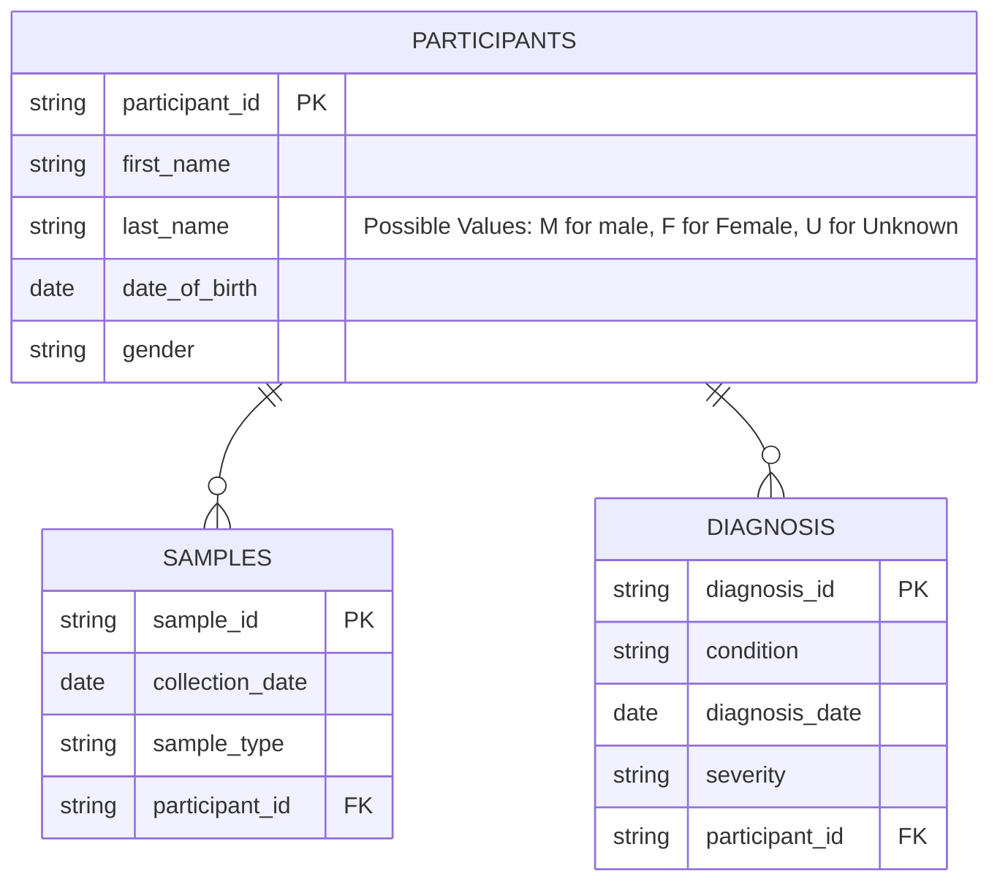
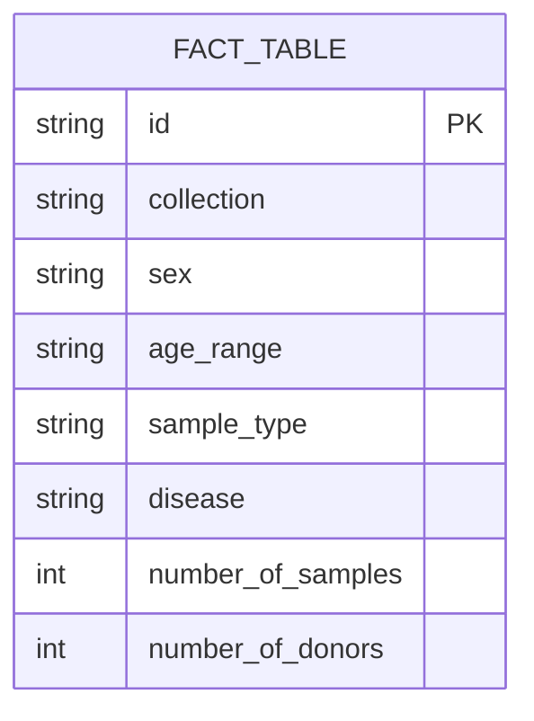

# ETL (Extraxtion, Transformation, Loading) Tutorial

## Introduction 
In this tutorial we will acquire familiarity with the ETL process and all the concepts that 
are related to it.
We will also try in practice some of the Python libraries that can be used to perform ETL tasks.

## Analyzing and querying a Data Warehouse
The file in /images/foodmart_schema.png shows the schema of the foodmart Data Warehouse.
According to this schema, identify the following objects:
- Fact Table(s)
- Measures (refer to sales_fact_1998 only)
- For the following dimensions, try to identify all the granularity levels the 
  dimensions are composed of, and all the fields that compose the granularity levels (they
  could also be contained in more than one table): 
             1. Product Dimension
             2. Time Dimension
             3. Store Dimension
             4. Customer Dimension
             5. Promotion Dimension

Now, refer to the OLAP service that we already showed during the lecture: 


https://eazybi.com/accounts/1/cubes

Then click on the blue button "new report" to load a new query OLAP interface
You can drag and drop the dimension on columns and rows according to the 
queries that you'll need to do. 
Navigate the cube(s) and try to answer the following business questions:
1. What is the total sales amount for Feb 2025?
2. Which are the top 3 products that better performed in Q1 2025?
3. Which country (Customers in country)performed better in 2025 in terms of sales amounts?
4. Which are the three cities of California having the highest sales amount in 2025 Q2?

## Implementing an ETL Pipeline
I this section we will try to implement an ETL pipeline, starting from the samples 
database implemented in the Data Management tutorial, using SQLAlchemy. 
If you remember, that database had the following schema:

The purpose of this pipeline is to create an ETL process that extracts the data from 
this schema and fills a Fact Table that is the same as the one used by the directory, and 
shown during the lesson. To so that, we wull use Python in conjunction with popular ETL
libraries such as Pandas. 
This is the structure of the Fact Table that we want to fill:

In this fact table, consider a situation where all the samples belonf to a single collection, suppose 
having this ID: "bbmri-eric:ID:IT_Test_Collection".

Now, let's start implementing the ETL pipeline. Consider these steps as a guideline. 

1. Install pandas library if not present in your environment
```bash
pip install pandas
```

2. Create a new Python script named etl_pipeline.py . Import the pandas library 
```python
import pandas as pd
```
3. Referring to the database you created and populated during the Data Management tutorial, (see the 
schema reference above), extract the data from the three tables (participants, samples, diagnosis) by 
using a unique query (single dataset) that joins all three. The row granularity will be the single 
sample, with all the related attribute, that will be used to populate the fact table. Here is an example 
of the query you can use:
```sql

select s.sample_id as sample_identifier, 
         s.collection_date as collection_date,
         s.sample_type as sample_type,
         p.sex as participanr_sex, 
         p.date_of_birth as participant_dob,
         d.diagnosis_id as diagnosis_id,
         from samples s, participants p, diagnosis d
         where s.participant_id = p.participant_id
         and p.participant_id = d.participant_id
```
4. Define a preliminary mapping and start to think about mappings and transcodings:
        - collection -> it is always equivalent to the collection id mentioned before
        - sex: -> taken from p.sex, but it needs to be transcoded according to fact table terminology for sex
        - age_range: -> it needs to be calculated from the participant_dob, and then transcoded according to the fact table terminology for age_range
        - sample_type -> it is equivalent to s.sample_type, but it needs to be transcoded according to the fact table terminology for sample_type
        - disease -> it is equivalent to d.condition, but it needs to be transcoded according
        - number_of_samples -> it needs to be computated after aggregation according to all the measures
        - number_of_donors -> it needs to be computated after aggregation according to all the measures, but it needs to be distinct

5. Use pandas to manage the extracted data, into a dataframe:
```python
# Assuming you have a database connection established
query = """
sselect s.sample_id as sample_identifier, 
         s.collection_date as collection_date,
         s.sample_type as sample_type,
         p.sex as participanr_sex, 
         p.date_of_birth as participant_dob,
         d.diagnosis_id as diagnosis_id,
         from samples s, participants p, diagnosis d
         where s.participant_id = p.participant_id
         and p.participant_id = d.participant_id
"""
```
Get the data with sql alchemy, and save it into a pandas dataframe:
```python
from sqlalchemy import create_engine
# Create a database connection (replace with your actual connection string)
engine = create_engine('sqlite:///your_database.db')  # Example for SQLite
# Read data into a pandas DataFrame
df = pd.read_sql(query, engine)
```
6. Now, start to implement the transformation phase, by applying the mappings and transcodings. 
Every row in the dataframe should be transformed according to the mapping defined before.
[To ve completed with details]
7. Now, scan the dataframe to compute the measures (number_of_samples, number_of_donors) and
Aggregating the roes having the same values for the dimensions:
[To ve completed with details]

            
    

