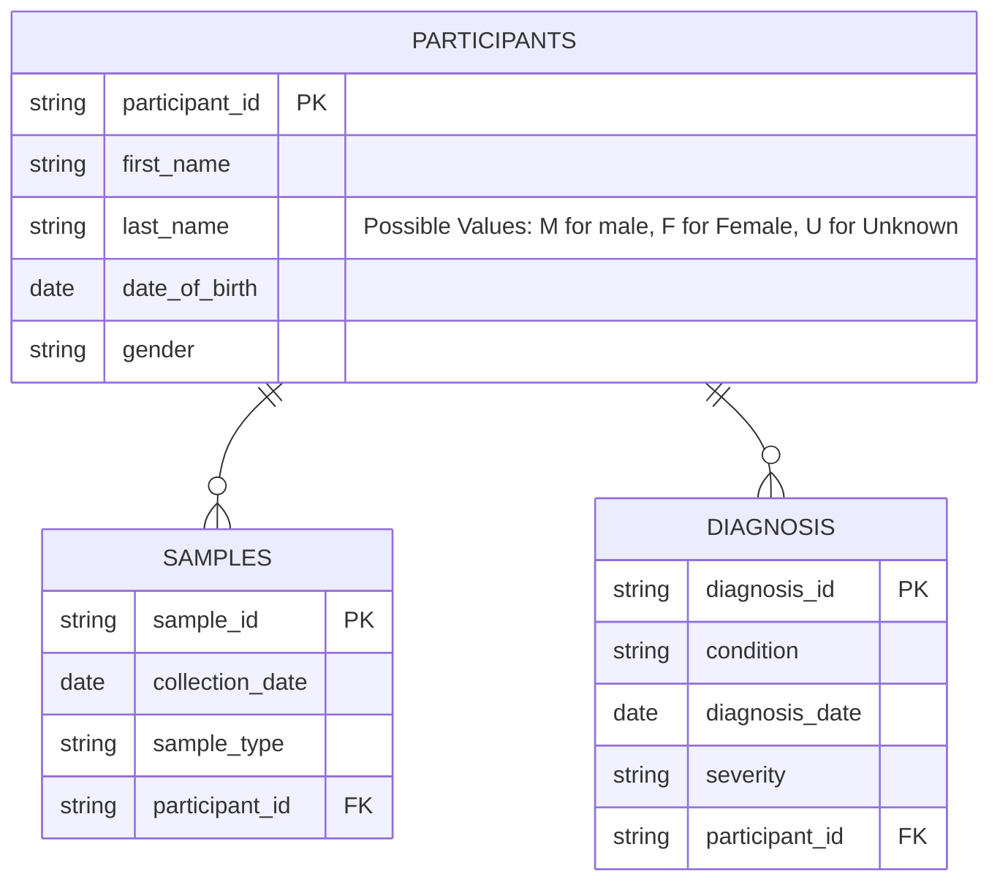
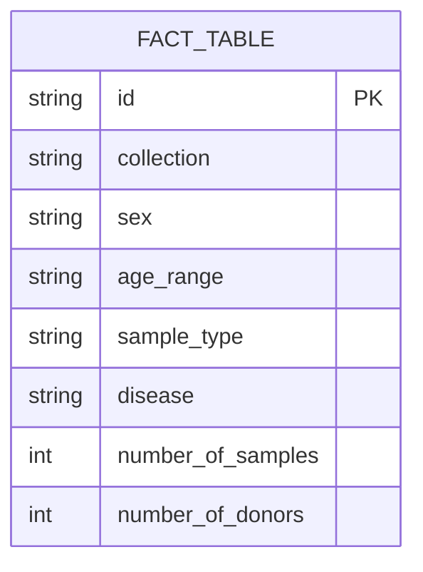

# ETL (Extraxtion, Transformation, Loading) Tutorial

## Introduction 
In this tutorial we will acquire familiarity with the ETL process and all the concepts that 
are related to it.
We will also try in practice some of the Python libraries that can be used to perform ETL tasks.

## Analyzing and querying a Data Warehouse
The [foodmart schema](./images/foodmart_schema.png) shows the schema of the Foodmart Data Warehouse.
According to this schema, identify the following objects:
- Fact Table(s)
- Measures (refer to sales_fact_1998 only, for simplicity)
- For the following dimensions, try to identify all the granularity levels the 
  dimensions are composed of, and all the related fields (they
  could also be contained in more than one table): 
             1. Product Dimension
             2. Time Dimension
             3. Store Dimension
             4. Customer Dimension
             5. Promotion Dimension

Now, refer to the OLAP service that we already queried during the lecture: 

https://eazybi.com/accounts/1/cubes

Click on the blue button "new report" to load a new query OLAP interface.
You can drag and drop the dimensions on columns and rows according to the 
queries that you'll need to do. 
Navigate the cube(s) and try to answer the following business questions:

1. What is the total sales amount for Feb 2025?
2. Which are the top 3 products that better performed in Q1 2025?
3. Which country (Customers in country)performed better in 2025 in terms of sales amounts?
4. Which are the three cities of California having the highest sales amount in 2025 Q2?

## Implementing an ETL Pipeline
I this section we will try to implement an ETL pipeline, starting from the samples 
database created in the Data Management tutorial, using SQLAlchemy. 
If you remember, that database had the following schema:

The purpose of the ETL pipeline is to create an ETL process that extracts the data from 
this schema and fills a Fact Table that is the same as the one used by the directory, and 
shown during the lesson. To so that, we wull use Python in conjunction with popular ETL
libraries such as Pandas. 

This is the structure of the Fact Table that we want to fill:

In this Fact Table, consider a scenario where all the samples belong to a single Collection, suppose 
having this ID: "bbmri-eric:ID:IT_Test_Collection".

Now, let's start implementing the ETL pipeline. Here are some driving steps. 

1. Install pandas library if not present in your environment
```bash
pip install pandas
```

2. Create a new Python script named etl_pipeline.py . Import the pandas library 
```python
import pandas as pd
```
3. Referring to the database you created and populated during the Data Management tutorial, (see the 
schema reference above), extract the data from the three tables (participants, samples, diagnosis) by 
using a single query (single dataset) that joins all three. The granularity of the single row in the 
query result will be the single 
sample, with all the related attributes, that will be used to populate the fact table. 


4. Define a preliminary mapping and start to think about mappings and transcodings:
        - collection -> it is always equivalent to the collection id mentioned before
        - sex: -> taken from participants.sex, but it needs to be transcoded according to the fact table terminology for sex
        - age_range: -> it needs to be calculated from the participant_dob, and then transcoded according to the Fact Table terminology for age_range
        - sample_type -> it is equivalent to samples.sample_type, but it needs to be transcoded according to the Fact Table terminology for sample_type
        - disease -> it is equivalent to diagnoses.condition, but it needs to be transcoded according to the Fact Table terminology for disease (ICD10 codes)
        - number_of_samples -> it needs to be computated after aggregation according to all the measures
        - number_of_donors -> it needs to be computated after aggregation according to all the measures, but it needs to be distinct


5. Use pandas to manage the extracted data into a dataframe.
Get the data with sql alchemy, and save it into a pandas dataframe. Here is a sample code:
```python
from sqlalchemy import create_engine
# Create a database connection (replace with your actual connection string)
engine = create_engine('sqlite:///your_database.db')  # Example for SQLite
# Read data into a pandas DataFrame
df = pd.read_sql(query, engine)
```
6. Now, start to implement the transformation phase, by applying mappings and/or transcodings. 
Every row in the dataframe should be transformed according to the mapping defined before.
Let's start with the mapping for sample types. This is the list of the possible sample types that your samples db created 
during the Data Management tutorial could have:
7. 
     ```python
        [
          "DNA",
          "RNA", 
          "Blood", 
          "Urine", 
          "Feces", 
          "Buffy Coat"
        ]
     ```
This is instead the list of the possible sample types that the fact table can have:

```python 
        [
      "NAV"
	  "PATHOGEN"
	  "RNA"
	  "FECES"
	  "THROAT_SWAB"
	  "CELL_LINES"
	  "SERUM"
	  "CDNA"
	  "TISSUE_FROZEN"
	  "SALIVA"
	  "BUFFY_COAT"
	  "NASAL_SWAB"
	  "OTHER"
	  "TISSUE_STAINED"
	  "PLASMA"
	  "PERIPHERAL_BLOOD_CELLS"
	  "MICRO_RNA"
	  "DNA"
	  "TISSUE_PARAFFIN_EMBEDDED"
	  "URINE"
	  "WHOLE_BLOOD"
        ]
```
     
You will neesd to define a transcoding dictionary that maps the sample types in the samples table to the sample types in the fact table:

```python
        sample_type_mapping = {
          "Blood": "WHOLE_BLOOD",
        ........
        }
```

The same will be done for the disease dimension. In this case, the list of all the disease used by your local samples db is the following:

```python
        [
          "Urinary tract infection", 
           "Human immunodeficiency virus disease",
           "Sepsis",
           "Malignant neoplasm of breast",
           "Acute tonsillitis",
           "Acute appendicitis",
           "Streptococcus group A infection",
           "Iron deficiency anemia",
           "Hypocalcemia",
           "Fatty liver"
        ]
```

Now, let's  write a dictionary mapping that maps them to the ICD10 codes used by the fact table:

```python
        disease_mapping = {
          "Urinary tract infection": "N39.0",
          ........
        }
```
     
From the web, search for the most appropriate ICD10 codes for the diseases in your samples db. You can use bioportal for that: 

https://bioportal.bioontology.org/ontologies/ICD10?p=classes

For the age range instead, we have to write a function that calculates the age range from the date of birth.
This is the list of the age ranges used by the fact table:

```python
age_range_categories = {
    'Infant': (0, 2),
    'Child': (2, 13),
    'Adolescent': (13, 18),
    'Young Adult': (18, 25),
    'Adult': (25, 45),
    'Middle-aged': (45, 65),
    'Aged (65-79 years)': (65, 80),
    'Aged (>80 years)': (80, 150)
}
```

Write a function name transcode_age that, given a date of birth, calculates the age range. 

Finally, we have to transcode the sex dimension. Here the mapping is very simple because the values used by the fact are only 
'MALE', 'FEMALE', 'UNKNOWN'. Define a dictionary gender_mapping for that.

We are now ready to modify the dataframe by applying all the transcodings and mappings defined before.

```python
df['collection'] = 'bbmri-eric:ID:IT_Test_Collection'
df[''sample_type'] = df['sample_type'].map(sample_type_mapping)
#add all the other mappings and transcodings
```

7. Now, scan the Dataframe to compute the measures (number_of_samples, number_of_donors), by 
aggregatipn, grouping  the rows having the same values for the dimensions. We will do it by a series of nested FORs in a way to compute the 
aggregated measures for each combination of dimensions:
```python
fact_data = []
for disease in df['disease'].unique():
    disease_filtered_df = df.query(f'disease=="{disease}"')
    for age_range in disease_filtered_df['age_range'].unique():
        age_filtered_df = disease_filtered_df.query(f'age_range=="{age_range}"')
        #... continue with the other dimensions
        #in the innermost loop, compute the measures. Here a sample code:
        number_of_samples = innermost_filtered_df.shape[0]
        number_of_donors = innermost_filtered_df['participant_id'].nunique()
        #append the row to the fact_data list
        fact_data.append({
            'collection': 'bbmri-eric:ID:IT_Test_Collection',
            [....]
```
Finally, write the code to save the Fact Table into a CSV file, and execute the script. 
        

    

            
    

