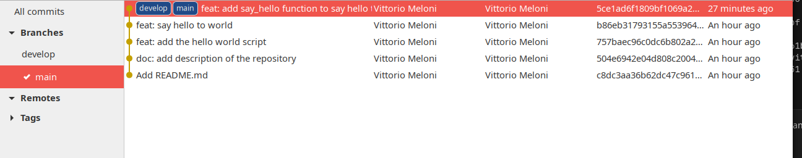
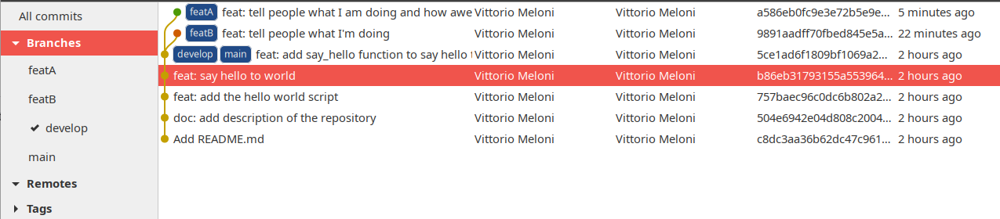
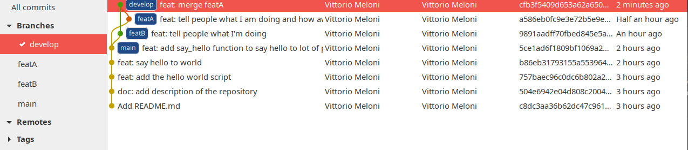
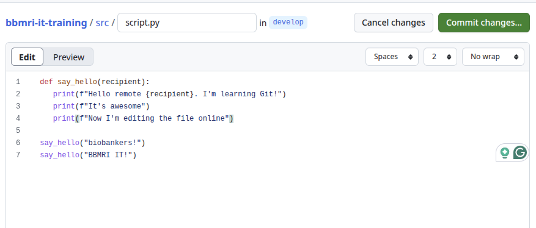

# Git Tutorial

This hands-on tutorial will help you get familiar with Git

**NB: The tutorial can be run on all operating systems, but if you're on Windows or MacOS and prefer using an Ubuntu machine you can [install it following this tutorial](https://ubuntu.com/tutorials/how-to-run-ubuntu-desktop-on-a-virtual-machine-using-virtualbox#1-overview)**

## First steps

1. Install Git on your computer
    
   Linux
   
   ```bash
   $ sudo apt install git
    ```
    
    MacOS
    
    ```bash
    brew install git
    ```
    
    Windows
   
    Download the latest Git installer at [Git for Windows](https://gitforwindows.org/).
    
1. Configure your account. This will set the name and email that will appear in your commit. 

   ```
   Use the email that you will use to create GitHub account
   ```

   ```bash
   $ git config --global user.name "Your Name"
   $ git config --global user.email yourmail@domain.tld
   ```

1. Create your first git repository 
   
   ```bash
   $ mkdir bbmri-it-git-tutorial
   $ cd bbmri-it-git-tutorial
   $ git init
   Initialized empty Git repository in /home/user/bbmri-it-git-tutorial
   ```

1. Create a file

   ```bash
   $ echo . > README.md
   ```

1. Check the status 
   
   ```bash
   $ git status
   On branch main
   No commits yet
   Untracked files:
     (use "git add <file>..." to include in what will be committed)
        README.md

   nothing added to commit but untracked files present (use "git add" to track
   ```

   git returns some useful information:
   
   * The name of the current branch: `main`
   * The fact that there are no commits yet
   * A list of untracked files (i.e., files that are in the current directory but not part of the repository yet)
   * Some hints about actions that you can do

1. Let's follow the hint and add the README.md file to the list of tracked files and check the status

   ```
   $ git add README.md
   $ git status
   On branch main

   No commits yet

   Changes to be committed:
     (use "git rm --cached <file>..." to unstage)
           new file:   README.md
   ```

   Something has changed: now git lists the changes that can be committed. The changes are: a new file has been added that was not part of the repository

1. Let's create our first commit: we commit the addition of the README.md
   
   ```bash
   $ git commit -m "Add README.md"
   [main (root-commit) 660ae42] Add README.md
   1 file changed, 0 insertions(+), 0 deletions(-)
   create mode 100644 README.md
   ```

   Git returns some information about the newly created commit, in particular the id of the commit (`660ae42`) followed by the commit message. Then some information about the files involved  in the commit

  > [!TIP]
  >
  > In case you didn't give the commit message with `-m "My first git commit"` git would have opened your default editor to add one.
  >
  > The default editor can be configured using the command:
  >
  > $ git config --global core.editor "vim"
  >
  > NB: The editor must be a valid command on your computer

1. Let's check again the status of the files

   ```
   $ git status
   On branch main
   nothing to commit, working tree clean
   ```

   git tells that there are no changes to commit

1. Now we can see the history of our repository

   ```bash
   $ git log
   commit 660ae424b9c05703a03d2f1b947c93e9ecc39497 (HEAD -> main)
   Author: Vittorio Meloni <vittorio.meloni@crs4.it>
   Date:   Thu Jun 12 14:16:55 2025 +0200

      Add README.md
   ```
   
   git returns the list of commits that (surprise) contains only our commit. As before git returns some useful information:
      * the commit id, which is the long version of the id. The first part is, of course, the same as the one returned after the commit
      * The position of the HEAD of our repository, which is our first commit
      * The information of the author of the commit, corresponding to the ones provided configured at the beginning
      * The date of the commit

1. Let's make some changes to the file. Open README.md with your favourite editor and add the line:

   `This is the repository of <your name> for the BBMRI.it Data Team School`

   Close the editor and check the status of the changes

   ```bash
   $ git status
   On branch main
   Changes not staged for commit:
     (use "git add <file>..." to update what will be committed)
     (use "git restore <file>..." to discard changes in working directory)
          modified:   README.md

    no changes added to commit (use "git add" and/or "git commit -a")
   ```

   Since `README.md` is part of the repository, the list of changes shows there is a `modified` file now. 
   
   Notice also the new hints about the actions that you can perform: `git add <file>` to stage the file for commit or `git restore <file>` to restore the file to the HEAD version 

1. Before staging the file for commit we can see the diff of the file against the HEAD

   ```bash
   $ git diff
   diff --git a/README.md b/README.md
   index e69de29..31016e2 100644
   --- a/README.md
   +++ b/README.md
   @@ -0,0 +1 @@
   +This is the first repository of Vittorio for the BBMRI.it Data Team School
   \ No newline at end of file
   ```

   For each changed file git shows the changes of the files with respect to the HEAD

   Here we can see that the line was added (+)

1. Let's stage the file for commit, commit the changes and see the status

   ```bash
   $ git add README.md
   $ git status
   On branch main
   Changes to be committed:
      (use "git restore --staged <file>..." to unstage)
            modified:   README.md
   ```
   
   We still have the same list of files but the message changed: git tells that the changes are staged and ready to be committed.

   Also look at the new hint: git suggests how to unstage the file.
   
1. Let's commit the changes and check the log

   ```bash
   $ git commit -m "doc: add description of the repository"
   [main 172dff9] doc: add description of the repository
   1 file changed, 1 insertion(+)
   
   $ git log
   commit 172dff9cbf78df528ee88170fb6cd71a56cbc0b0 (HEAD -> main)
   Author: Vittorio Meloni <vittorio.meloni@crs4.it>
   Date:   Thu Jun 12 15:17:30 2025 +0200

       doc: add description of the repository

   commit e91c0112bade625b4425d3d15d18b910da3df4d3
   Author: Vittorio Meloni <vittorio.meloni@crs4.it>
   Date:   Thu Jun 12 14:16:55 2025 +0200

       Add README.md
   ```

   git returns the list of commits. We see the first commit and the last one and we can see that the HEAD is changed

  > [!TIP]
  >
  > In case, after a commit, we notice some error in the commit message we can use the `--amend` option to change the last commit message.
  > 
  > (e.g., `git commit --amend -m "correct message"`)
  >
  > **NB: only the last commit can be amended**
   
   
## Branching

In this section we will start to use branches so we can diverge from the main line without messing with it and restarting 

1. First of all we can check the list of branches in our repository

   ```bash
   $ git branch
   * main
   ```

   Currently, we only have the `main` branch.
  
1. Let's create a new branch named `develop` and check again the list of branches

   ```bash
   $ git branch develop
   $ git branch
   develop
   * main
   ```

   Now the list contains the new `develop` branch, but we are still in the `main` branch as indicated by the `*` before the name.

  > [!TIP]
  >
  > When your repository contains several branches, it may be really (really!) helpful to always have a glimpse of the current branch 
  > 
  > In bash, you can set the PS1 variable in your .bashrc file to include the current git branch in your command prompt 
  >
  > An example is:
  >
  > `PS1='$(__git_ps1 " (%s)")\ $ '`
  > 
  > that results in
  >
  > (main) $

1. We can now move to `develop` branch:
   
   ```bash
   (main) $ git switch develop
   Switched to branch 'develop'
   ```

   ```
   (develop) $ git branch
   * develop
   main
   ```

1. Let's start to add some new content to our project by creating a new python script and commiting it

   ```bash
   (develop) $ mkdir src/
   (develop) $ echo . > src/script.py
   (develop) $ git add src/script.py
   (develop) $ git commit -m "feat: add the hello world script"
   [develop f3de86b] feat: add the hello world script
   1 file changed, 0 insertions(+), 0 deletions(-)
   create mode 100644 src/script.py
   ```

  > [!TIP]
  >
  > Git doesn't allow the addition of a new empty directory (i.e., we couldn't directly add the src directory, it would have resulted in no effect). There may be situations when we want to have an empty directory. In this cases we can add a `.keepme` file into the directory to keep it
  
1. Let's check the updated history
   
   ```bash
   (develop) $ git log
   commit f3de86bc2769edefa18f728649b43b6fff3ecb83 (HEAD -> develop)
   Author: Vittorio Meloni <vittorio.meloni@crs4.it>
   Date:   Thu Jun 12 17:20:22 2025 +0200

       feat: add the hello world script

   commit 172dff9cbf78df528ee88170fb6cd71a56cbc0b0 (main)
   Author: Vittorio Meloni <vittorio.meloni@crs4.it>
   Date:   Thu Jun 12 15:17:30 2025 +0200

       doc: add description of the repository

   commit e91c0112bade625b4425d3d15d18b910da3df4d3
   Author: Vittorio Meloni <vittorio.meloni@crs4.it>
   Date:   Thu Jun 12 14:16:55 2025 +0200

       Add README.me
   ```

   Now the log shows that the HEAD is in the develop branch where we have one commit while the `main` is one commit behind

1. We can start editing our script
  
   Add the following function to your python script

   ```python
   print("Hello world!")
   ```

   And now perform the commit as you know at this point! :)

   ```bash
   (develop) $ git add src/script.py
   (develop) $ git commit -m "feat: say hello to world"
   ```

   **NB You may have noticed that we have started using [conventional commits](https://www.conventionalcommits.org/en/v1.0.0/). This is really encouraged!**

1. Let's change our files to say hello to lot of people

   ```python
   def say_hello(recipient):
      print(f"Hello {recipient}")

   say_hello("biobankers!")
   say_hello("BBMRI IT!")
   say_hello("")
   ```

   And stage the file for changes
   

   ```bash
   (develop) $ git add src/script.py
   On branch develop
   Changes to be committed:
     (use "git restore --staged <file>..." to unstage)
           modified:   src/script.py
   ```

1. Wait! In the last line we said hello to no one. We don't want to create a commit with this error. Let's unstage the file

   ```bash
   (develop) $ git restore --staged src/script.py
   (develop) $ git status
   On branch develop
   Changes not staged for commit:
     (use "git add <file>..." to update what will be committed)
     (use "git restore <file>..." to discard changes in working directory)
           modified:   src/script.py

   no changes added to commit (use "git add" and/or "git commit -a")
   ```

   We unstaged the file so we don't have anything to commit.

   **NB: Notice that unstaging the file doesn't remove the changes to it. To discard the changes we should `git restore` the file after  unstaging it**

1. After removing the line, commit the changes

   ```bash
   (develop) $ git add src/script.py
   (develop) $ git commit -m "feat: add say_hello function to say hello to lot of people"
   ```

1. We have made quiet some changes now. Let's check the log and see the history them

   ```
   commit 5ce1ad6f1809bf1069a2754a555eca86f8540a65 (HEAD -> develop)
   Author: Vittorio Meloni <vittorio.meloni@crs4.it>
   Date:   Fri Jun 13 10:20:44 2025 +0200

       feat: add say_hello function to say hello to lot of people

   commit b86eb31793155a5539646d7475c193610308e95b
   Author: Vittorio Meloni <vittorio.meloni@crs4.it>
   Date:   Fri Jun 13 10:01:40 2025 +0200

       feat: say hello to world

   commit 757baec96c0dc6b802a2a785e3f2521c774df82d
   Author: Vittorio Meloni <vittorio.meloni@crs4.it>
   Date:   Fri Jun 13 09:52:06 2025 +0200

       feat: add the hello world script

   commit 504e6942e04d808c2004d46ad6034c6b6873f0b3 (main)
   Author: Vittorio Meloni <vittorio.meloni@crs4.it>
   Date:   Fri Jun 13 09:50:56 2025 +0200

       doc: add description of the repository

   commit c8dc3aa36b62dc47c961bc5b7a866656144e8694
   Author: Vittorio Meloni <vittorio.meloni@crs4.it>
   Date:   Fri Jun 13 09:48:51 2025 +0200

       Add README.md
   ```
   
   We notice that there are 5 changes now in develop now, but main is still at commit `504e694`

   Let's visualize the repository to clarify the current situation. (we are using [gitg](https://wiki.gnome.org/Apps/Gitg/) here)

   

1. We decided that we have enough changes and we want to merge them into the `main` branch. First let's go back to main

   ```bash
   (develop) $ git switch main
   (main) $ git log
   commit 504e6942e04d808c2004d46ad6034c6b6873f0b3 (HEAD -> main)
   Author: Vittorio Meloni <vittorio.meloni@crs4.it>
   Date:   Fri Jun 13 09:50:56 2025 +0200

       doc: add description of the repository

   commit c8dc3aa36b62dc47c961bc5b7a866656144e8694
   Author: Vittorio Meloni <vittorio.meloni@crs4.it>
   Date:   Fri Jun 13 09:48:51 2025 +0200

       Add README.md
   ```
  
   Now the `HEAD` is in `main` and the list of commits only contains the previous commits

1. And now we can merge the changes

   ```bash
   (main) $ git merge develop
   Updating 504e694..5ce1ad6
   Fast-forward
   src/script.py | 5 +++++
   1 file changed, 5 insertions(+)
   create mode 100644 src/script.py
   ```

   Git recap the changes performed in `develop`. 


1. As usual let's see the log

   ```bash
   (main) $ git log
   commit 5ce1ad6f1809bf1069a2754a555eca86f8540a65 (HEAD -> main, develop)
   Author: Vittorio Meloni <vittorio.meloni@crs4.it>
   Date:   Fri Jun 13 10:20:44 2025 +0200

       feat: add say_hello function to say hello to lot of people

   commit b86eb31793155a5539646d7475c193610308e95b
   Author: Vittorio Meloni <vittorio.meloni@crs4.it>
   Date:   Fri Jun 13 10:01:40 2025 +0200

       feat: say hello to world

   commit 757baec96c0dc6b802a2a785e3f2521c774df82d
   Author: Vittorio Meloni <vittorio.meloni@crs4.it>
   Date:   Fri Jun 13 09:52:06 2025 +0200

       feat: add the hello world script

   commit 504e6942e04d808c2004d46ad6034c6b6873f0b3
   Author: Vittorio Meloni <vittorio.meloni@crs4.it>
   Date:   Fri Jun 13 09:50:56 2025 +0200

       doc: add description of the repository

   commit c8dc3aa36b62dc47c961bc5b7a866656144e8694
   Author: Vittorio Meloni <vittorio.meloni@crs4.it>
   Date:   Fri Jun 13 09:48:51 2025 +0200

       Add README.md
   ```

   Git shows here that now `develop` and `main` converged on the same commit

   

1. It's time to raise the bar and create some conflicts!

   First, we create two more branches from develop that we call featA and featB

   ```bash
   (main) $ git switch develop
   (develop) $ git branch featA
   (develop) $ git switch -c featB
   ```

   Notice that we used `git switch -c featB` that is a shorcut for `git branch featB; git switch featB`

   We are in featB branch now

   Let's edit the script adding a sentence to tell people what we're doing.

   ```python
   def say_hello(recipient):
      print(f"Hello {recipient}. I'm learning Git!")

   say_hello("biobankers!")
   say_hello("BBMRI IT!")
   ```

   And as usual we commit our changes. 

   ```bash
   (featB) $ git add src/script
   (featB) $ git commit -m "feat: tell people what I'm doing"
   (featB) $ git log
   commit 9891aadff70fbed845e5a85c17271d8d7badf3fa (HEAD -> featB)
   Author: Vittorio Meloni <vittorio.meloni@crs4.it>
   Date:   Fri Jun 13 11:34:58 2025 +0200

      feat: tell people what I'm doing

   commit 5ce1ad6f1809bf1069a2754a555eca86f8540a65 (main, featA, develop)
   Author: Vittorio Meloni <vittorio.meloni@crs4.it>
   Date:   Fri Jun 13 10:20:44 2025 +0200

       feat: add say_hello function to say hello to lot of people
  
   ...
   ```
   
   We added a new commit in `featB`. Nothing different for now

1. Let's leave `featB` and move to `featA`

   ```bash
   (featB) $ git switch featA
   ```

   Edit again the script. 

   ```python
   def say_hello(recipient):
      print(f"Hello {recipient}. I'm learning GIT!")
      print(f"It's awesome")

   say_hello("biobankers!")
   say_hello("BBMRI IT!")
   ```

   And commit the changes

   ```bash
   (featA) $ git add src/script.py
   (featA) $ git commit -m "feat: tell people what I am doing and how awesome it is"
   (featA) $ git log 
   commit a586eb0fc9e3e72b5e9e963e212346711a2ac2e3 (HEAD -> featA)
   Author: Vittorio Meloni <vittorio.meloni@crs4.it>
   Date:   Fri Jun 13 11:51:28 2025 +0200

       feat: tell people what I am doing and how awesome it is

   commit 5ce1ad6f1809bf1069a2754a555eca86f8540a65 (main, develop)
   Author: Vittorio Meloni <vittorio.meloni@crs4.it>
   Date:   Fri Jun 13 10:20:44 2025 +0200

       feat: add say_hello function to say hello to lot of people

   ...
   ```

1. We decided that both feature branches have done enough work and we want to merge them in develop.

   First we switch to `develop` branch

   ```bash
   (featA) $ git switch develop
   ```

   Let's visualize the situation now

   

   We see that both branches diverged from the same point and both have made one change.
   
1. Let's start merging from `featB`

   ```bash
   (develop) $ git merge featB
   Updating 5ce1ad6..9891aad
   Fast-forward
   src/script.py | 2 +-
   1 file changed, 1 insertion(+), 1 deletion(-)
   ```
   
   Great! It works. 
   
   Time to merge `featA`

   ```bash
   (develop) $ git merge --no-ff featA
   Auto-merging src/script.py
   CONFLICT (content): Merge conflict in src/script.py
   Automatic merge failed; fix conflicts and then commit the result.
   (develop|MERGING) $
   ```

   Doh! Git tell us there is a conflict. We need to fix it before continuing.
   
   **NB: the changes to PS1 gives us also some information about the status. In this case it tells us that we have a MERGE in progress**

1. Let's open the file and check what's going on

   ```python
   def say_hello(recipient):
   <<<<<<< HEAD
      print(f"Hello {recipient}. I'm learning Git!")
   =======
      print(f"Hello {recipient}. I'm learning GIT!")
      print(f"It's awesome")
   >>>>>>> featA

   say_hello("biobankers!")
   say_hello("BBMRI IT!")
   ```

   Git shows us the conflict! 

   The code between `<<<<<<< HEAD` and `=======` is the current develop, where we already merged `featB`

   The code between `=======` and `>>>>>>> featA` is the one we want to merge. 
   
   The problem here is that we modified the same line differently. In `featB` we wrote "Git" in `featA` we wrote "GIT", all uppercase.

   Git couldn't decide which line was correct so it gives us the responsibility to resolve the conflict

   We decide to keep "Git!" from `featB` and the rest from `featA`

   ```python
   def say_hello(recipient):
      print(f"Hello {recipient}. I'm learning Git!")
      print(f"It's awesome")

   say_hello("biobankers!")
   say_hello("BBMRI IT!")
   ```

1. Now we need to tell Git that the conflicts are fixed. As usual `git status` comes in handy
   
   ```bash
   (develop|MERGING) $ git status
   On branch develop
   You have unmerged paths.
     (fix conflicts and run "git commit")
     (use "git merge --abort" to abort the merge)

   Unmerged paths:
     (use "git add <file>..." to mark resolution)
           both modified:   src/script.py

   no changes added to commit (use "git add" and/or "git commit -a")
   ```

   Git suggests what to do to tell it that we solved the conflicts. Let's do this.

   ```bash
   (develop|MERGING) $ git add src/script.py
   (develop|MERGING) $ git status
   On branch develop
   All conflicts fixed but you are still merging.
     (use "git commit" to conclude merge)

   Changes to be committed:
           modified:   src/script.py
   ```

   Hang in there! We're almost done

   We just need to commit the fixing as `git status` suggests

   ```bash
   (develop|MERGING) $ git commit -m "feat: merge featA"
   [develop cfb3f54] feat: merge featA
   (develop) $
   ```

   **NB: Git doesn't take responsiblity of the content of the conflicting files. It's up to you. In other words, if you don't change the conflicting files and perfom `git add` without removing the conflict, git accept it. No worries, though you can always perform another commit to solve the situation**

1. Let's check the history now

   ```bash
   (develop) $ git log 
   commit cfb3f5409d653a62a650a3ffa2311c8f693368c1 (HEAD -> develop)
   Merge: 9891aad a586eb0
   Author: Vittorio Meloni <vittorio.meloni@crs4.it>
   Date:   Fri Jun 13 12:26:24 2025 +0200

       feat: merge featA

   commit a586eb0fc9e3e72b5e9e963e212346711a2ac2e3 (featA)
   Author: Vittorio Meloni <vittorio.meloni@crs4.it>
   Date:   Fri Jun 13 11:51:28 2025 +0200

       feat: tell people what I am doing and how awesome it is

   commit 9891aadff70fbed845e5a85c17271d8d7badf3fa (featB)
   Author: Vittorio Meloni <vittorio.meloni@crs4.it>
   Date:   Fri Jun 13 11:34:58 2025 +0200

       feat: tell people what I'm doing

   commit 5ce1ad6f1809bf1069a2754a555eca86f8540a65 (main)
   Author: Vittorio Meloni <vittorio.meloni@crs4.it>
   Date:   Fri Jun 13 10:20:44 2025 +0200

       feat: add say_hello function to say hello to lot of people
   ```

   Now we have in `develop` the commits from the two feature branches plus a "merge" commit.

   Visually, we can see that all the two branches have converged to `develop` 

   

1. Since the works on `featA` and `featB` are done and everything is merged in `develop` we can remove the branches.

   ```bash
   (develop) $ git branch -D featA featB
   Deleted branch featA (was a586eb0).
   Deleted branch featB (was 9891aad)
   ```

## Working with remote repositories

It's time to work with remote branches to keep our files on a server and to collaborate on projects

We will use repository on GitHub so, if you don't have one, [create an account](https://docs.github.com/en/get-started/start-your-journey/creating-an-account-on-github)
and [a repository](https://docs.github.com/en/get-started/start-your-journey/hello-world) (steps 1 and 2).
You can name your repository as you want. For the tutorial we will use the name `bbmri-it-data-training`

1. Clone your newly created repository locally and enter the directory

   ```bash
   $ git clone https://github.com/<your_username>/bbmri-it-training
   Cloning into 'bbmri-it-training'...
   $ cd bbmri-it-training
   (main) $
   ```
  
   We have created a complete copy of the remote repository in our local machine

1. By defult, git refers to the remote repository as the `origin`. We can check the name and the url of the remote repository with the command `git remote -v`

   ```bash
   (main) $ git remote -v
   origin  git@github.com:<your_username>/bbmri-it-training.git (fetch)
   origin  git@github.com:<your_username>/bbmri-it-training.git (push)
   ```
   
1. Let's create a README.md, write a simple documentation and commit it.

   ```bash
   (main) $ git add README.md
   (main) $ git commit -m "doc: first documentation"
   ```
1. We have created a new commit in our local repository. The remote `origin` repository is not updated though. To send our commits to the remote repository we use the `push` command

   ```bash
   (main) $ git push origin main
   Enumerating objects: 3, done.
   Counting objects: 100% (3/3), done.
   Writing objects: 100% (3/3), 268 bytes | 268.00 KiB/s, done.
   Total 3 (delta 0), reused 0 (delta 0), pack-reused 0 (from 0)
   To github.com:<your_username>/bbmri-it-training.git
   * [new branch]      main -> main
   ```

1. Let's see the current log

   ```bash
   (main) $ git log
   commit ba78648d9b538267cad8335c67f7ef028281f077 (HEAD -> main, origin/main)
   Author: Vittorio Meloni <vittorio.meloni@crs4.it>
   Date:   Fri Jun 13 14:57:00 2025 +0200

       doc: initialize documentation
   ```

   Git log shows that `main` and the `origin/main` (the version of main in the remote) are aligned

1. Let's create the script as previously, commit and push

   ```bash
   (main) $ git add src/script.py
   (main) $ git commit -m "feat: add script"
   (main) $ git push origin main
   ```
1. The next step is to fetch remotely created branches. 
   
   Go to your repository page on Github and create the develop branch following the [official tutorial](https://docs.github.com/en/get-started/start-your-journey/hello-world#creating-a-branch)

   Now launch the command to fetch branches

   ```bash
   (main) $ git fetch
   From github.com:<your_username>/bbmri-it-training
   * [new branch]      develop    -> origin/develop
   ```

   It created a copy of the remote branch called `origin/develop` that will get the changes from the remote repository each time we will fetch them.

   To start working on `develop` we need to move to the local branch

   ```bash
   (main) $ git switch develop
   branch 'develop' set up to track 'origin/develop'.
   Switched to a new branch 'develop'
   ```

   Notice the info `branch 'develop' set up to track 'origin/develop'.`

   Git is telling us that the branch `develop` is linked to the branch `origin/develop`
   
1. Let's start adding some changes. We can edit the `src/script.py`, commit the changes and check the status

   ```python
   def say_hello(recipient):
      print(f"Hello remote {recipient}. I'm learning Git!")
      print(f"It's awesome")

   say_hello("biobankers!")
   say_hello("BBMRI IT!")
   ```

   ```bash
   (develop) $ git add src/script.py
   (develop) $ git commit -m "feat: add remote to greetings"
   (develop) $ git status
   On branch develop
   Your branch is ahead of 'origin/develop' by 1 commit.
      (use "git push" to publish your local commits)

   nothing to commit, working tree clean
   ```

   Notice that the `status` gives us hints about the status of the local copy of `develop` with respect to the `origin`

   Now you can push to `origin/develop`

   ```bash
   (develop) $ git push origin develop
   ```

1. Next step is getting changes from remote branch to our local version repository.

   Go to your repository page on GitHub and go to `develop`
  
   

   Navigate to the `src/script.py` file.

   Click on the edit icon 

   

   write some changes and commit them

   

  > [!TIP] 
  > On GitHub you can open an online Visual Studio Code editor of your repository by pressing `.` (dot) on your keyboard.

1. Our local copy is now behind the remote. We need to fetch the changes that will be applied to `origin/develop`

   ```bash
   (develop) $ git fetch origin develop
   remote: Enumerating objects: 7, done.
   remote: Counting objects: 100% (7/7), done.
   remote: Compressing objects: 100% (3/3), done.
   remote: Total 4 (delta 0), reused 0 (delta 0), pack-reused 0 (from 0)
   Unpacking objects: 100% (4/4), 1.09 KiB | 1.09 MiB/s, done.
   From github.com:<your_username>/bbmri-it-training
    * branch            develop    -> FETCH_HEAD
      f461f60..7adb0e6  develop    -> origin/develop
   ```
   
   And finally, apply them with merge

   ```bash
   (develop) $ git merge origin/develop
   Updating f461f60..7adb0e6
    Fast-forward
    src/script.py | 5 +++--
    1 file changed, 3 insertions(+), 2 deletions(-)
   ```

  > [!TIP]
  >
  > git provides a shortcut for `fetch` + `merge` which is `git pull`
  > We could obtain the same result with `git pull origin develop`
